# Filament Manager

Filament Manager is a desktop-first inventory app for 3D printer filament. It
tracks physical spools, loans, printer slots, filament usage, wishlist/order
items, catalog data, and optional Bambu AMS live observations in one local
library.

The app is built as a Tauri desktop application with a React UI and a Rust
backend. It can run as a single local installation, as a host for other desktop
clients, or as a local webapp/companion server for paired browsers on the same
LAN.

## Product Tour

A quick look at the main desktop and Companion workflows. Click a preview to
open the larger screenshot, or open the full
[screenshot tour](docs/SCREENSHOTS.md).

<p align="center">
  <a href="docs/screenshots/dashboard.jpg">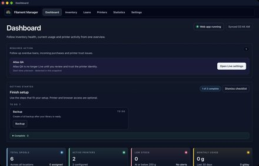</a>
  <a href="docs/screenshots/dashboard-consumption.jpg">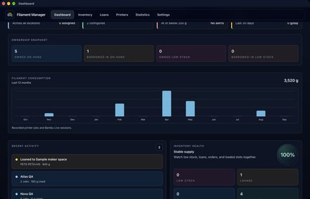</a>
  <a href="docs/screenshots/inventory.jpg">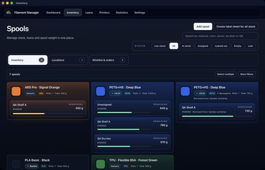</a>
  <a href="docs/screenshots/inventory-locations.jpg">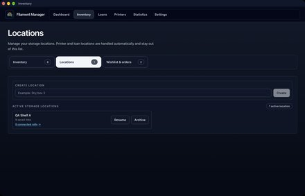</a>
  <a href="docs/screenshots/add-filament.jpg">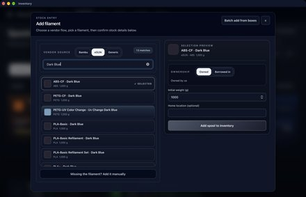</a>
  <a href="docs/screenshots/bambu-batch-add.jpg">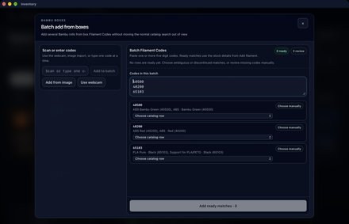</a>
  <a href="docs/screenshots/wishlist-queue.jpg">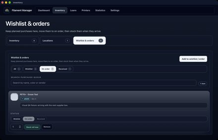</a>
  <a href="docs/screenshots/loan-out.jpg">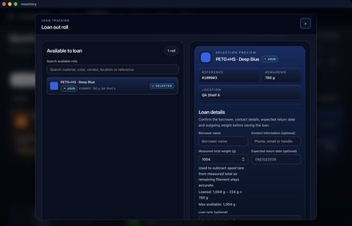</a>
  <a href="docs/screenshots/printers.jpg">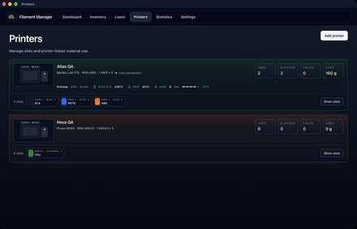</a>
  <a href="docs/screenshots/add-printer.jpg">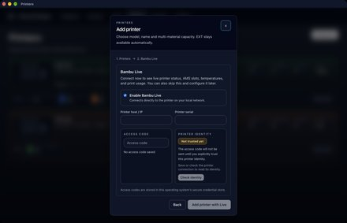</a>
  <a href="docs/screenshots/printer-ams-weight-estimate.jpg">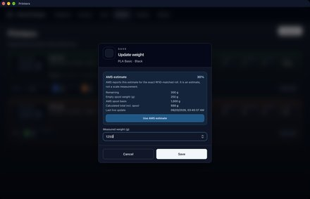</a>
  <a href="docs/screenshots/statistics.jpg">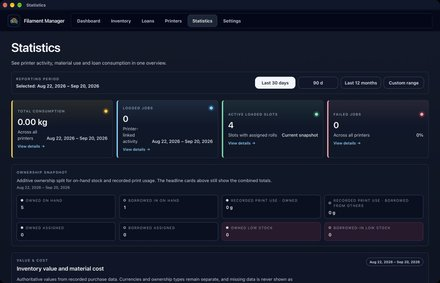</a>
  <a href="docs/screenshots/filament-details.jpg">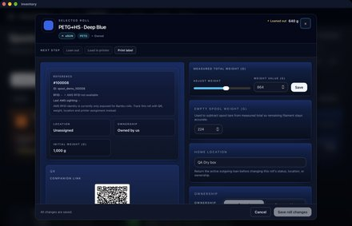</a>
  <a href="docs/screenshots/filament-label.jpg">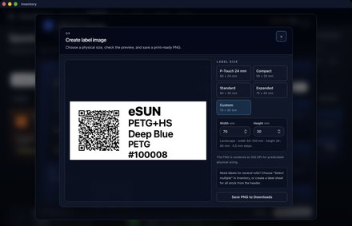</a>
  <a href="docs/screenshots/inventory-label-sheet.jpg">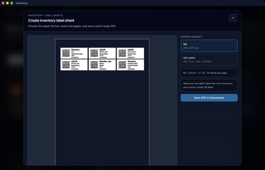</a>
  <a href="docs/screenshots/filament-history.jpg">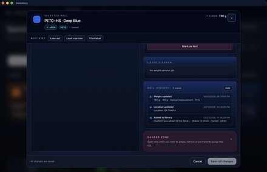</a>
  <a href="docs/screenshots/settings-general.jpg">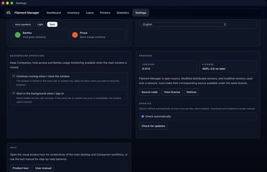</a>
  <a href="docs/screenshots/settings-filament-defaults.jpg">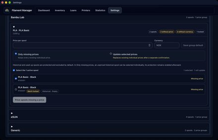</a>
  <a href="docs/screenshots/settings-updates.jpg">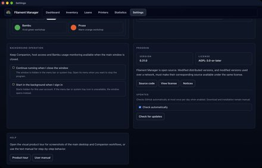</a>
  <a href="docs/screenshots/companion-tablet-inventory.jpg">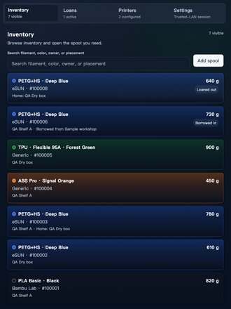</a>
  <a href="docs/screenshots/companion-phone-inventory.jpg">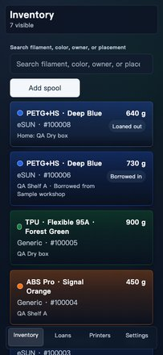</a>
</p>

## Documentation

Start with the user guide for product behavior and workflows:

- Norwegian: [docs/BRUKERVEILEDNING.md](docs/BRUKERVEILEDNING.md)
- English: [docs/USER_GUIDE.md](docs/USER_GUIDE.md)
- Screenshot tour: [docs/SCREENSHOTS.md](docs/SCREENSHOTS.md)
- macOS installation and verification:
  [docs/MACOS_DISTRIBUTION.md](docs/MACOS_DISTRIBUTION.md)
- Contributing: [CONTRIBUTING.md](CONTRIBUTING.md)
- Community standards: [CODE_OF_CONDUCT.md](CODE_OF_CONDUCT.md)
- Security policy: [SECURITY.md](SECURITY.md)
- Release integrity and source SBOM: [docs/SUPPLY_CHAIN.md](docs/SUPPLY_CHAIN.md)

Release notes:

- [v0.29.0](docs/releases/RELEASE_NOTES_v0.29.0.md)
- [v0.28.0](docs/releases/RELEASE_NOTES_v0.28.0.md)
- [v0.27.0](docs/releases/RELEASE_NOTES_v0.27.0.md)

The repository keeps the three most recent release-note files. Older notes
remain available in the [v0.29.0 source snapshot](https://github.com/bliatun-code/Filament-Manager/tree/v0.29.0),
and published release tags are retained.

## Feature Overview

- Inventory for owned and borrowed-in filament spools, with progressive
  rendering, shown/total controls for large result sets, compact normal browsing,
  and an explicit multi-selection mode for reviewed atomic bulk actions.
- Stable user-managed storage locations can be created, renamed, archived,
  restored, merged, and—when completely unreferenced—deleted. Association counts
  open the exact filtered inventory view, while printer and loan locations stay
  automatic and outside the shelf-management list.
- Add filament flow for Bambu, eSUN, generic/manual entries, Bambu Filament
  Code lookup, manual Bambu code batch entry, and quantity-aware wishlist/order
  receipt with partial deliveries. Wishlist and ordering now have a dedicated
  Inventory workspace.
- Loan tracking for outgoing loans and borrowed-in spools, including returns and
  CSV export.
- Printer profiles for Bambu AMS, Prusa MMU3, Prusa XL toolheads, and
  single-material printers.
- Compact printer cards that keep assigned filament swatches and material names
  visible while detailed slots are collapsed.
- Dashboard consumption keeps the **Last 30 days** card separate from a rolling
  twelve-month chart based on local calendar months. The chart runs oldest to
  newest, keeps zero-use months visible, and totals recorded printer-linked
  jobs and Bambu Live usage from the same twelve buckets.
- Dashboard follow-up separates important overdue-loan, incoming-order, and
  trust work from quieter optional low-stock suggestions. Suggestions can be
  collapsed or hidden locally without changing inventory data.
- Filament defaults provide global and material-specific low-stock thresholds,
  a default purchase currency, and inventory-derived price groups. Missing-only
  and confirmed overwrite modes respect per-spool price locks and protect
  historical or unavailable rolls from accidental repricing.
- Purchase metadata, bounded reporting periods, inventory value, material cost,
  traceable coverage gaps, and deterministic consumption forecasts make price
  and usage data auditable without currency conversion or guessed supplier data.
- Optional Bambu Live integration for local AMS slot observations, RFID matching,
  estimated AMS weight, Bambu filament settings/status diagnostics, nozzle
  temperature, and print-session usage accounting. Printer identity is approved
  locally before authentication; reusable secrets stay in macOS Keychain or
  Windows Credential Manager instead of SQLite.
- Supported Bambu models offer Bambu Live as an optional second step while the
  printer is added. It can still be skipped and configured later. An enabled
  integration without trusted TLS identity stays offline and shows a clickable
  Dashboard warning that opens that printer's Live settings for review.
- Passive Bambu printer discovery listens on both current announcement ports
  and can identify a local printer by its announced serial number even while
  Bambu Studio is open. One unambiguous result fills the Live host and serial
  automatically. The same discovery engine can recover a DHCP-changed printer
  address in the background only after the saved serial and public-key pin
  match again. Recovery is credential-free and never sends the access code;
  the same guarded recovery also remains available manually.
- QR/RFID support for robust spool lookup and safer automatic AMS matching.
- Print-ready QR labels for individual rolls as 300-DPI PNG files, including
  validated custom landscape dimensions remembered on the device. Matching A4
  or US Letter inventory label sheets remain fixed at 60 × 24 mm and are saved
  as PDF files, all through the Downloads workflow.
- Local companion/webapp for paired phones, tablets, and workshop browsers;
  long inventory and loan lists use incremental result controls, and library
  reads and writes require an authenticated paired session.
- Optional desktop background operation on macOS and Windows can hide a close
  request to the menu bar or system tray and start the app hidden when the
  current user signs in. Companion, Host/LAN reconciliation, mDNS, and Bambu
  Live usage monitoring continue while the window is hidden; Open/Quit restore
  or stop the single running instance through localized native menus.
- Appearance choices preserve the existing Auto, Light, and Dark modes and add
  playful, unofficial dark-based Bambu and Prusa themes. Desktop and Companion
  keep their theme preferences locally and independently; filament, material,
  and status swatches remain data colors instead of being recolored by a theme.
- On macOS and Windows, Companion advertises one stable `.local` address through
  mDNS. New browser and desktop pairings and new QR labels use this address, so
  DHCP address changes do not break them. The library-bound name uses the short,
  typeable form `fm-xxxxxxxx.local`; opening its address without a path redirects
  to Companion. The app verifies that the stable name
  resolves to the selected private LAN address before enabling pairing or
  permanent QR links, and only one active Host can publish a library's name.
  Devices must be on the same LAN with mDNS allowed. Existing IP-based clients
  must pair once again, and QR labels printed with an old IP address must be
  reprinted; the exact numeric IP remains available in settings as a diagnostic
  fallback.
- Host/client library mode for sharing one desktop-owned library with other
  authenticated desktop installations. A client Dashboard paints its last-good
  cached view first, including cached consumption, then refreshes from the Host
  in the background. Initial role and data resolution does not flash a false
  Host-unavailable state, and cached, partial, or offline pages use one shared
  retryable fallback message.
- Catalog refresh and maintenance for Bambu and eSUN filament data starts with
  lightweight read-only discovery of the currently available material
  families. One selected family is refreshed at a time; blocked, incomplete, or
  changed vendor sources preserve local data and never mark unseen rows
  discontinued automatically.
- Catalog refresh jobs are owned by the Host and share one active operation
  across desktop windows and clients. Reopening Settings resumes job status;
  a lost response is recovered by job ID without submitting another import.
  Completed results are stored atomically with catalog changes, and interrupted
  Host processes leave an explicit interrupted result instead of restarting work.
- Portable full JSON backups that omit device-local credentials and pairing
  state. Backup v1 includes schema/app metadata while remaining compatible with
  older v1 files that lack it; backups from a newer schema are rejected before
  data is changed. Program maintenance also shows when this device last
  completed a validated full-backup download.
- Schema v6 startup checks and verified local SQLite recovery snapshots before
  older-schema upgrades, full restores, and storage migrations that replace or
  merge an existing database. The additive v0.28 migrations introduce stable
  locations, purchase metadata, and filament pricing standards.
- Application/database health diagnostics and a privacy-sanitized support JSON
  download under **Settings → Program maintenance**, including the non-secret
  build commit, target, and distribution channel.
- A dismissible, data-backed setup checklist that separates required setup from
  optional printer/Companion work and collapses completed steps, plus
  device-local preferences for Inventory layout/filter expansion and the
  last-used Settings tab.
- Optional automatic update notifications plus an explicit **Check for
  updates** action, both using only a build-configured public metadata channel.
  When enabled, release builds check after a short startup delay at most once
  per 24 hours and show a banner only for a newer version; download and
  installation remain manual.

## Languages

Filament Manager can be used in 21 languages:

- English, Norwegian Bokmål, German, French, Spanish, Brazilian Portuguese,
  Italian, Polish, Dutch, Czech, Swedish, Danish, Finnish, and Turkish.
- Simplified Chinese, Traditional Chinese, Japanese, and Korean.
- Ukrainian, Russian, and Hungarian.

Language is selected from one compact list under **Settings → General**. Every
selectable language ships complete desktop and Companion catalogs without a
Beta label. English remains the canonical source and emergency inline fallback,
but published locale catalogs cannot depend on missing English rows. All
selectable locales pass key, parameter, plural, message-format, and runtime
loading contracts. Visual and accessibility checks remain separate release
gates. Corrections and current-catalog native review are welcome through the
dedicated
[translation correction form](https://github.com/bliatun-code/Filament-Manager/issues/new?template=translation.yml)
or pull requests. The current language set is intentionally stable while these
20 non-English catalogs receive community corrections and native-language
review.

## License

Filament Manager is licensed under the GNU Affero General Public License v3.0
or later (`AGPL-3.0-or-later`).

You may use, study, modify, and redistribute this software, including
commercially. If you distribute modified versions, or run a modified version
for users over a network, you must make the corresponding source code available
under the same license.

This license is intended to keep improvements to Filament Manager open and
available to its users. See [LICENSE](LICENSE) for the full license text and
[NOTICE.md](NOTICE.md) for trademark and attribution notices.

## Repository Layout

- `Cargo.toml` + `src/backend/`: the private `filament-manager-core` workspace
  crate with platform-neutral domain and SQLite behavior.
- `src-tauri/`: Tauri shell, Rust commands, Companion server, Bambu Live
  transport/sync, trusted-LAN, storage startup, and desktop integration.
- `ui/`: React desktop UI, UI models, tests, and styling.
- `scripts/`: local validation, Tauri wrapper, and contract checks.
- `docs/`: user-facing guides.
- `.github/workflows/release-build.yml`: protected tag/manual workflow for the
  signed Universal 2 DMG and Windows MSI artifacts, including Developer ID
  signing, notarization, stapling, installer verification, and checksums.

See [Architecture](docs/ARCHITECTURE.md) for the Rust workspace, startup and
Bambu Live boundaries.

## Requirements

- Node.js `24.x`
- npm `>=10`
- Rust 1.88 or newer for Tauri builds; `rust-toolchain.toml` selects the
  reviewed Rust 1.98.0 toolchain through rustup
- Xcode app + Command Line Tools for macOS builds
- `sqlite3` CLI is optional as a fallback for visual-QA database tooling
- Current macOS DMG: Apple Silicon or Intel and macOS 11.0 Big Sur or newer

The project uses the local Tauri CLI from npm dependencies through
`npm run tauri`, so a global `cargo tauri` install is not required.

## Install

Use clean installs when preparing CI/release-like work:

```bash
npm ci
npm --prefix ./ui ci
```

For normal local development, `npm install` in both package roots is also fine:

```bash
npm install
npm --prefix ./ui install
```

## Development

Run the desktop app in Tauri dev mode:

```bash
npm run tauri -- dev
```

Run it against a persistent, isolated local-only database without changing the
saved role of the normally installed app:

```bash
npm run dev:local
```

The local-only database is stored at `tmp/dev-local/filament-manager.db`. On the
first run, the command creates a sanitized, writable SQLite snapshot from the
installed app's preserved local library or its latest standalone recovery
snapshot. It removes client pairing, machine credentials, Trusted LAN state,
and printer connection secrets from the copy. Later runs reuse the populated
copy, while the ignored `tmp/` directory keeps it outside version control.

Run the frontend alone:

```bash
npm --prefix ./ui run dev
```

Run the health check:

```bash
npm run doctor
```

## Verification

Full local verification:

```bash
npm run verify
```

What `verify` covers:

- UI production build
- UI lint
- companion/webapp tests
- React/UI model tests
- seed catalog, Bambu catalog data, and printer model data contracts
- Tauri invoke and companion route contract checks
- UI reachability and architecture checks
- tracked-file privacy, secret-shape, internal-document, and broken-link checks
- version consistency checks
- doctor/runtime checks
- Rust formatting
- Rust tests, including the real-TCP Host/Client resilience gate with a separate
  Host subprocess and isolated Host and Client databases
- Rust clippy with warnings denied

Useful narrower checks:

```bash
npm run smoke
npm run test:ui
npm run test:companion
npm run test:rust
npm run check:contracts
cargo test -p bambu-filament-manager library_sync_resilience_tests -- --nocapture
```

`test:ui` and `test:companion` also accept `--grep "name pattern"` for focused
Node test runs.

Dependency/audit checks:

```bash
npm outdated
npm --prefix ./ui outdated
npm run check:npm-licenses
npm run audit:npm
npm run audit:cargo
npm run check:cargo-licenses
cargo update --dry-run --verbose
```

`npm run audit:dependencies` runs both vulnerability audits and both license
policies together. GitHub also runs these live advisory checks on a weekly
schedule; they intentionally remain outside the reproducible `verify` command.
See [Dependency Security And License Policy](docs/DEPENDENCY_SECURITY.md) for
the reviewed allowlists, exact tool versions, and exception rules.

## Build

Build the desktop app with the local Tauri CLI:

```bash
npm run tauri -- build
```

Build a local Universal 2 macOS DMG:

```bash
rustup target add aarch64-apple-darwin x86_64-apple-darwin
npm run tauri -- build --target universal-apple-darwin --bundles dmg
```

Validate the ordinary local Universal 2 DMG after the build:

```bash
npm run verify:macos-local -- \
  /path/to/Filament\ Manager_0.29.0_universal.dmg \
  --architectures=arm64,x86_64
```

This local gate checks DMG integrity and install layout, the exact app version,
bundle identity, minimum macOS version, architecture, privacy strings,
entitlements, and a strict ad-hoc Hardened Runtime signature. Disk-image
creation, mounting, and verification require access to the macOS DiskImages
service and therefore cannot run inside a restricted build sandbox. The local
gate does not claim Developer ID signing or notarization; only
`verify:macos-release` accepts an official release artifact.

On macOS, `npm run tauri` ad-hoc signs ordinary local builds so bundle
entitlements are applied. To avoid Apple File Provider metadata invalidating a
reused app bundle, a signed local build without an explicit
`CARGO_TARGET_DIR` writes to the temporary target path printed by the wrapper.
Set `CARGO_TARGET_DIR` to another non-File-Provider location when a stable
output path is needed. Official tagged macOS artifacts are Developer ID signed,
notarized, and stapled. Before GitHub release publication, the workflow
downloads the internally uploaded candidate, mounts that exact release DMG,
copies its app without clearing quarantine metadata, opens the isolated
installation through LaunchServices, and runs the mutating packaged desktop
gate against a private database. That gate creates and updates a spool,
completes a loan and return, creates a printer and slot assignment, restarts the
installed app, and validates a complete portable backup. The public macOS
contract is one Universal 2 artifact with native `arm64` and `x86_64`
executables on macOS 11 Big Sur or newer. The exact downloaded DMG is installed
and exercised on both Apple Silicon and Intel GitHub-hosted runners before
publication. See
[macOS Installation And Verification](docs/MACOS_DISTRIBUTION.md) for the user
installation and checksum flow.

Build only a Windows MSI on Windows:

```powershell
npm ci
npm --prefix ./ui ci
npm run doctor
npm run smoke
npm run tauri -- build --bundles msi
```

Windows MSI uses the per-user WiX template in `src-tauri/wix/per-user.wxs`.
Official Windows artifacts are checked for the expected product name, version,
and x64 architecture. The uploaded candidate is then downloaded again,
installed, and exercised through the same spool, weight, loan, return, printer
slot, restart, and full-backup flow against an isolated runtime database before
its workflow job can succeed. The smoke also requires both the MSI and installed
executable to report Authenticode `NotSigned`; Windows installer signing remains
intentionally deferred by project decision. See
[Windows Installation And Verification](docs/WINDOWS_DISTRIBUTION.md) for the
download and checksum flow.

## Release Status

- Latest release page: https://github.com/bliatun-code/Filament-Manager/releases/latest
- Current version: `0.29.0`
- Version source of truth must stay aligned across:
  - `package.json`
  - `package-lock.json`
  - root `Cargo.toml` for the shared core crate
  - `src-tauri/Cargo.toml`
  - `Cargo.lock`
  - `src-tauri/tauri.conf.json`
  - this README current version
  - the matching versioned release notes file under `docs/releases/` and its
    README link

The version guard is included in:

```bash
npm run check:version
npm run verify
```

## GitHub Actions Release Artifacts

The release workflow builds installer artifacts from version tags and
maintainer-approved manual runs. A version tag publishes the GitHub release
only after the exact commit has passed macOS and Windows CI, both installers
and their checksum manifests pass verification, each exact release installer
has passed the mutating installed-app E2E and restart against an isolated
runtime database, the source dependency SBOM and its checksum pass validation,
and public releases receive signed installer provenance:

- Workflow: `.github/workflows/release-build.yml`
- Tag trigger: a version tag matching `v*`
- Publish environment: `github-release`; repository settings must restrict it
  to matching version tags
- Public verification identity: repository variable `EXPECTED_APPLE_TEAM_ID`;
  it must contain the 10-character Apple Team ID and match the protected
  `macos-release` environment secret before a macOS build starts
- Manual trigger: `workflow_dispatch` for a selected platform
- Outputs:
  - `filament-manager-macos-dmg-<run-id>` with the normalized DMG and
    `SHA256SUMS.txt`
  - `filament-manager-windows-msi-<run-id>` with the verified MSI and
    `SHA256SUMS-windows.txt`
  - `filament-manager-release-sbom-<run-id>` with a validated SPDX 2.3 source
    dependency SBOM and `SHA256SUMS-sbom.txt`
  - for public tag releases, `filament-manager-release-provenance-<run-id>`
    with signed GitHub/Sigstore provenance for both installers

The macOS build job fails instead of publishing an ad-hoc fallback when
signing, notarization, stapling, Universal 2 verification, checksum generation,
or the Apple Silicon installation smoke fails. A separate least-privilege Intel
job downloads the same checksummed DMG and verifies, installs, and launches it
natively. Release publication and public provenance require both macOS jobs.
Release assets are assembled only from those verified job outputs. The Windows
job likewise fails before upload unless exactly one non-empty MSI has the
expected product name, normalized release version, and x64 package
architecture. A failed candidate cannot reach the publish job. Release assets
are assembled into a draft, checked against the verified local file names and
sizes, and published only after the upload is complete. Repository release
immutability then prevents later replacement of assets for releases created
after that setting was enabled; a mismatch is investigated rather than
silently replaced. The SBOM describes source and lockfile dependencies rather
than the exact binary contents of either installer. See
[Release Integrity And Supply Chain](docs/SUPPLY_CHAIN.md) for verification and
scope details.

The source repository is public. Its security controls, history-scanning
procedure, contribution boundary, and release-setting checklist are described
in [Public Repository Security](docs/PUBLIC_REPOSITORY.md).

## Installers and App Data

macOS:

- Download DMG from the latest GitHub release.
- App data path is typically
  `~/Library/Application Support/no.bliatun.filamentmanager`.
- Installation and verification:
  [docs/MACOS_DISTRIBUTION.md](docs/MACOS_DISTRIBUTION.md)

If Bambu Live works in development but the installed DMG reports `No route to
host` for a reachable printer, allow Filament Manager in `System Settings ->
Privacy & Security -> Local Network`, then restart the app. The installed app
uses a different macOS privacy identity than the development process.

Windows:

- Supported installer path: Windows 11 + Tauri MSI.
- MSI default install path:
  `C:\Users\<user>\AppData\Local\Filament Manager`
- App data path:
  `C:\Users\<user>\AppData\Local\no.bliatun.filamentmanager`
- The MSI is per-user and should not require Administrator privileges for the
  default install path.
- Uninstall removes installed app files but keeps local app data unless that data
  is removed manually.

## Database Safety and Support Diagnostics

Before writing to an existing database at startup, the app performs a read-only
schema compatibility preflight and SQLite `quick_check`. A database created by
a newer schema or one that fails the integrity check is stopped rather than
silently rewritten. An existing unversioned, schema-v1, schema-v2, schema-v3,
or schema-v4 database receives a verified local recovery snapshot before its
automatic schema-v5 upgrade. Location, purchase-metadata, and pricing-standard
migrations run in one transaction. The same safeguard is used before a full
restore and storage migrations that replace or merge an existing database; the
operation does not continue if its snapshot cannot be created and verified.

Portable `filament-manager-backup-v1` exports include `schema_version` and
`app_version` metadata. Older v1 exports without these fields remain supported,
while a declared schema version newer than the app supports is rejected before
the active library is modified. The Backup panel records the time of the latest
validated full-backup download on the current device. This local activity hint
does not inspect or upload the saved file and is separate from backup contents.

**Settings → Program maintenance → Application diagnostics** shows app/schema
version, SQLite quick/FK checks, journal mode, database size, and the local
database path after an explicit reveal. The downloadable support JSON
deliberately excludes database contents and the local path, as well as names,
IP addresses, printer serials, tokens, QR/RFID values, and raw printer
telemetry. It contains only high-level health metadata and privacy-filtered
operational events, plus the build commit, target, and distribution channel.
The update metadata URL is not included.

Update checking is disabled unless a release build explicitly contains an
anonymous public HTTPS metadata endpoint. When automatic checking is enabled,
eligible release builds check after a short startup delay at most once per 24
hours. Only a newer version produces an automatic banner; current-version and
failure results stay silent, while the manual check remains available for
explicit status. Download and installation are always manual. Because the
public channel was configured after the `v0.22.0` installers were built, those
installations need one manual bridge upgrade before automatic notifications can
work. See [Update Metadata Channel](docs/UPDATE_CHANNEL.md) for the fail-safe
contract and publication choices.

## Catalog Updates

Update supported vendor catalogs only from **Settings → Filament catalog** in
the desktop app. First select a vendor and choose **Discover available
materials**. This makes a small, bounded, read-only storefront check and only
refreshes the list of material types currently available from that source; it
does not import products or change catalog lifecycle state. Then select exactly
one discovered material type and refresh it. The app deliberately avoids
full-catalog batch downloads and does not expose a parallel command-line
scraper.

Catalog data is stored in SQLite in `filament_master_list`. The app ships with
a sanitized, case-normalized seed catalog in
`src/data/seed_filament_catalog.json` so old or currently unavailable
manufacturer listings stay searchable when users add rolls they already own or
find through resellers. The seed is deduplicated by material, filament name, and
color name after normalization, and contains only master catalog metadata, never
spool, loan, printer, RFID, location, or usage history.

The Settings UI uses a lightweight discovery step for supported Bambu and eSUN
catalog sources. Discovery makes a small, bounded, read-only request to the
vendor storefront. It imports nothing, changes no catalog lifecycle state, and
keeps the previous material list if the source is blocked or inconclusive. After
a successful discovery, choose exactly one available material type to refresh;
larger catalog maintenance is intentionally split into lower-traffic runs.
Neither discovery nor a selected-material refresh automatically marks catalog
entries as historical/discontinued, so older and reseller-only products remain
searchable. Bambu discovery reads only the complete, bounded collection listing;
only a selected family opens its public product metadata, without retries.
Bambu color swatches prefer the local official hex table before
falling back to name-based color estimates. Swatches remain backward compatible
with single `#RRGGBB` values, and can also store `multi(#RRGGBB,#RRGGBB,...)`
for hard segmented multi-colour rolls or `gradient(#RRGGBB,#RRGGBB,...)` for
smooth transition rolls.

## Data Model Notes

- Spool edits, status changes, weight updates, RFID updates, printer assignments,
  loan events, live usage, deletions, and lifecycle changes are tracked in local
  history.
- Deleting a spool normally hides it from active inventory while preserving
  history.
- Permanent purge is available for cases where the spool and related records
  should truly be removed.
- Every printer gets an `EXT` slot so single-spool usage works even without a
  multi-material system.
- The supported printer model catalog is shared by desktop, webapp, and host
  code. Bambu Lab entries also keep their Bambu Studio printer profile code so
  diagnostics can display familiar upstream names without duplicating model
  maps in the UI.
- Bambu AMS weight is treated as an estimate, not as a physical scale reading;
  live usage accounting is intentionally conservative.
- When a fresh, exact RFID-matched AMS estimate is too far from stored weight
  for automatic sync, the printer slot weight dialog can offer an explicit
  correction. Accepting that estimate updates remaining filament without
  inventing a print job for usage that happened while the app was away.
- Bambu Studio filament settings signals such as `tray_info_idx` and
  `tray_id_name` are diagnostic material/profile hints, not physical spool
  identity. Saved RFID/tray UUID data remains the strong identity signal for
  automatic AMS matching.

## Stability Goals

The project is configured to keep working when upstream dependencies change:

- Vendor discovery and one-material refreshes use bounded request budgets and
  keep existing catalog data unchanged when a source is blocked or inconclusive.
- Visual-QA database tooling can fall back to the `sqlite3` CLI when
  `better-sqlite3` is unavailable.
- Tauri configuration uses the v2 schema with explicit capabilities.
- Local wrapper scripts keep CI and developer commands consistent.

## Troubleshooting

`npm run doctor` reports that npm or the local Tauri CLI is unavailable:

- Verify Node 24 is installed.
- Reopen the terminal after installing Node.
- Run `npm install` to restore the local `@tauri-apps/cli` dependency.

`npm run smoke` fails in companion or UI tests:

- Run `npm ci`.
- Run `npm --prefix ./ui ci`.
- Re-run `npm run smoke`.

Windows MSI install fails with permission errors:

- Use the current per-user MSI from `target/release/bundle/msi`.
- Do not force install into `Program Files`.

App starts but data appears empty:

- Check whether the expected app data directory exists.
- Check whether `filament-manager.db` was created on first run.
- If using Client mode, verify the host is reachable and pairing is valid.

`sqlite3` CLI warning in `doctor`:

- This is not a blocker when `better-sqlite3` is available and `doctor` reports
  `ok`.

## Tauri Config Source of Truth

Use `src-tauri/tauri.conf.json` as the primary Tauri app config. Windows-specific
bundle overrides live in `src-tauri/tauri.windows.conf.json`.
