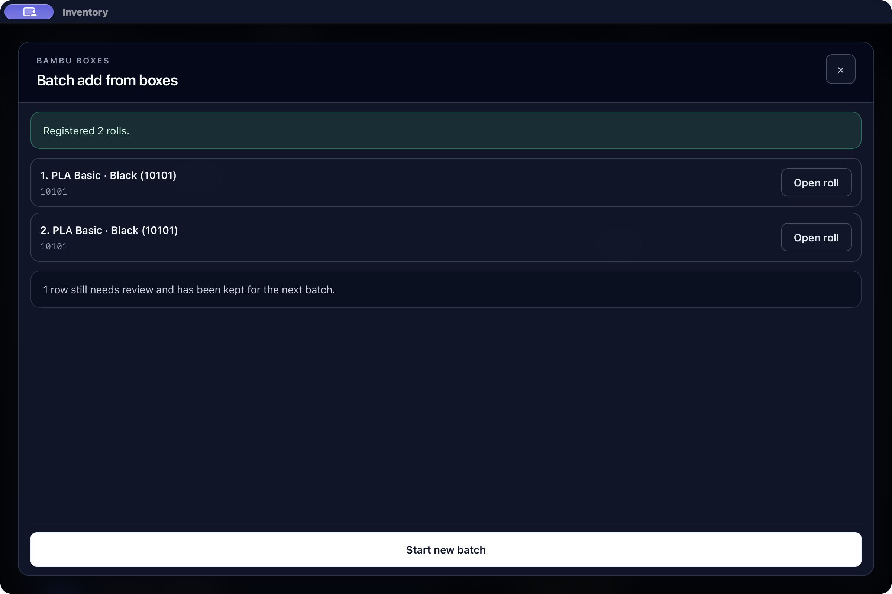
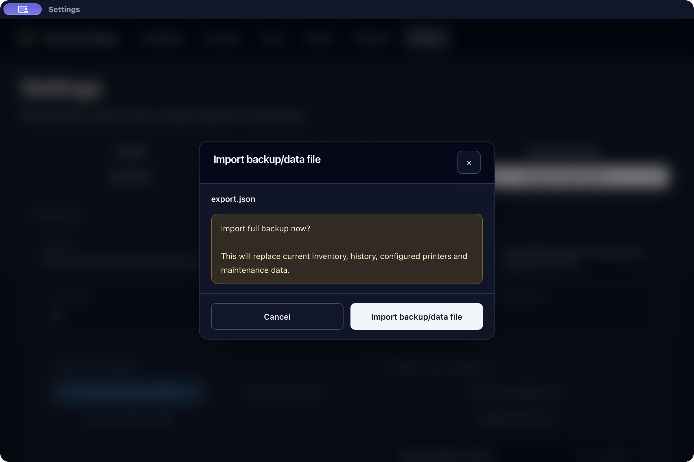

# Oppfølging av Bambu-batch – 6. september 2026

Bambu-batch bruker nå én atomisk registrering med en varig kvittering.
Dette følger kodefunnet i [forrige oppfølging](REGISTRATION_FOLLOWUP_2026-09-06.md):
den tidligere løkken kunne lagre første rull, feile på neste og deretter sende
hele utkastet med nye ID-er. Den nye kontrakten lagrer alle valgte ruller
sammen, og et nytt forsøk med samme forespørsel henter samme kvittering.

Dette er en teknisk oppfølging av en risiko funnet i koden. Ingen
dobbeltregistrering ble observert som menneskelig brukerfeil i
[AI-evalueringen](USABILITY_AGENT_EVALUATION_2026-09-06.md), og denne rapporten
inneholder ingen nye menneskelige tids- eller fullføringsmålinger.

## Registrering og gjenopptakelse

- Før første skrivekall lagrer klienten den komplette forespørselen med
  batch-ID, valgte katalog-ID-er, vekt, eierskap, lokasjon og radetiketter.
  Utkastet kopieres slik at senere feltendringer ikke kan endre et nytt forsøk.
  Hvis gjenopprettingsdata ikke kan lagres eller leses, sperres registreringen.
- Mens lagring pågår er feltene og nye innsendinger sperret. Etter bekreftet
  lagring erstattes utkastet av alle returnerte ruller. «Åpne rullen» på hver
  rad bruker akkurat den autoritative ID-en for den raden.
- Et mistet svar gir en egen tilstand for ukjent utfall. Den er ikke bevis
  på at databasen er uendret. «Fortsett samme batch» sender den samme
  uforanderlige forespørselen med samme batch-ID.
- Gjenåpning av dialogen eller appen leser lagrede gjenopprettingsdata uten
  å sende en ny registrering automatisk. En bekreftet kvittering vises igjen;
  et uavklart forsøk krever et eksplisitt nytt forsøk.
- «Start ny batch» etter bekreftet lagring rydder de fullførte radene og
  beholder opprinnelig tekst for rader som fortsatt trenger avklaring.
  Gjentatte, gyldige koder er fortsatt separate fysiske ruller. De skal ikke
  slås sammen bare fordi de peker på samme katalogpost.
- Bare en kjent avvisning av et ferskt forsøk gjør «Rediger batch» tilgjengelig.
  Dette gjelder backendvalidering som har rullet tilbake hele batchen og
  manglende batchstøtte på Host før en POST er sendt. Det opprinnelige
  utkastet gjenopprettes for retting. Hvis et tidligere forsøk allerede hadde
  ukjent utfall, avklarer en senere avvisning før POST ikke dette utfallet;
  forespørselen forblir sperret for redigering og ny batch.
- Dersom lagring er bekreftet, men oppdatering av den lokale kvitteringen
  feiler, beholdes suksessvisningen. Det tidligere, varige forsøket kan
  fremdeles gjenopptas med samme ID etter omstart.

Den lokale gjenopprettingsnøkkelen inneholder bibliotekidentitet og
målgenerasjon. Svar og handlinger fra et tidligere mål kan ikke bekrefte en
registrering i det nye målet, heller ikke ved bytte A → B → A. Et gammelt
forsøk flyttes ikke automatisk til et annet bibliotek.

## Atomisk kontrakt

`CatalogSpoolBatchInput` inneholder `batch_id`, en ordnet liste `master_ids`,
`initial_weight_g`, `ownership_type` og valgfrie eier-/lokasjonsfelt. Listen
må inneholde 1–100 elementer. Rekkefølge og gjentatte katalog-ID-er bevares:
to like elementer gir to ruller med hver sin genererte ID. Kvitteringen er
`{ batch_id, spool_ids }` i samme rekkefølge som forespørselen.

Backend lagrer ruller, lokasjon, eventuelle innlån, historikk, revisjoner og
kvittering i én SQLite-transaksjon. En ugyldig senere katalog-ID eller en
feil under oppretting av et senere lån etterlater ingen delvis batch.
Valideringsfeil som beviser at batchen ikke ble lagret bruker
`inventory.batch.invalid`. Database- og transportfeil behandles konservativt
som ukjent utfall i klienten.

For samme batch-ID leses en allerede lagret kvittering før backend
revaliderer katalogposter, lokasjon og andre data som kan ha blitt endret
etter lagring. Et identisk, normalisert forsøk returnerer de samme ID-ene
uten å legge til ruller, lån, historikk eller revisjoner. Dette gjelder også
etter omstart og etter at en registrert rull er slettet. Samme batch-ID med
annen normalisert forespørsel eller bibliotekidentitet gir
`inventory.batch.conflict`; HTTP-ruten returnerer 409. En slik konflikt gir
ikke klienten grunnlag for å anta at ingenting tidligere ble lagret.

## Local, Client og Host

Begge nye Tauri-kommandoer krever forventet bibliotek-ID og målgenerasjon.
Den lokale kommandoen holder samme autoritetslås som bibliotekbytte gjennom
rolle-/identitetskontrollen og databasetransaksjonen. Client-rolle og gamle
identiteter avvises før en lokal registrering kan utføres.

Host-ruten er `POST /api/v1/spools/catalog-batch` og annonseres med
capability `catalog-spool-batch-v1`. Client kontrollerer det lagrede målet og
Host-identiteten før registrering. En eldre Host uten capability avvises
før autentisering eller POST med `inventory.batch.host_unsupported`.
Klienten faller ikke tilbake til individuelle registreringer.

Det opprinnelige målet beholdes gjennom autentisering og eventuell
401-fornyelse. Det kontrolleres på nytt før hver POST og før et mottatt svar
kan brukes. Batch-POST har en frist på 30 sekunder. Et avbrudd gir ikke en
automatisk omsending; eksplisitt gjenopptakelse bruker den varige batch-ID-en.

Etter gyldig kvittering er oppdatering av spool-cache, loan-cache for innlån,
location-cache og status best effort og bundet til det opprinnelige målet.
En lesefeil, statusfeil eller et målbytte under oppdateringen gjør ikke den
bekreftede transaksjonen til en mislykket registrering. Gamle resultater kan
ikke skrives inn i en ny Client-kontekst. Ingen av Host-skrivefeilene har
lokal lagerregistrering som reservehandling.

## Skjema, backup og reset

Migrasjon `008_catalog_spool_batches.sql` oppgraderer skjema 6 til 7 og legger
til `catalog_spool_batches`. Hver rad lagrer bibliotek-ID, normalisert
forespørsel og kvittering. Tabellen har ingen fremmednøkkel til rullene:
sletting av en rull skal ikke gjøre det mulig å opprette samme batch på nytt.

Kvitteringene er operasjonelle data for denne installasjonen. Full backup
i JSON-format eksporterer dem ikke. Appens import av full backup bevarer
derimot installasjonens eksisterende batchkvitteringer, også ved bytte av
bibliotek via import. Et gammelt uavklart forsøk kan dermed ikke opprette
gjenopprettede ruller en gang til. Hvis en eldre backup ikke inneholder de
opprinnelige rullene, returnerer samme forsøk fortsatt de opprinnelige
ID-ene uten å gjenskape dem. «Åpne» kan da melde at rullen ikke finnes.

Full app-reset (`resetAppState`) rydder kvitteringene og oppretter en ny
bibliotekidentitet. Katalogreset og purging av enkeltruller bevarer dem.
En målgenerasjon alene er ikke tilstrekkelig vern ved backupimport: egen
backup kan beholde bibliotek-ID og tilbakestille generasjonen. Vernet ved
JSON-gjenoppretting er derfor den bevarte kvitteringen. Garantien omfatter
ikke manuell erstatning eller sletting av hele databasefilen, eller flytting
av en portabel backup til en annen installasjon uten denne journalen.

Se [migrasjonsrutinen](DATABASE_MIGRATIONS.md) for den uendrede append-only-
regelen. Publisert migrasjonshistorikk og publiseringsgrense er beholdt.

Den native backupkontrollen avdekket også at den tidligere `window.confirm`
ikke viste noen bekreftelse i Mac-webvisningen: importen ble avbrutt uten
synlig forklaring. Full backupimport bruker nå en egen appdialog med
filnavn og eksisterende advarsel om hvilke data som erstattes. «Avbryt» har
startfokus. Bekreftelsen gjelder det allerede leste og validerte innholdet;
bytte av bibliotek, rolle eller målgenerasjon avbryter et ventende forsøk.
CSV-/lagerimport beholder sin eksisterende sammenslåingsflyt.
En fil som erklærer full backupformat går heller ikke videre til import
dersom forhåndsvalideringen feiler; dermed kan en forbigående valideringsfeil
ikke omgå bekreftelsen.

En bekreftet import registreres før innstillingene lastes på nytt. Dermed
beholdes resultatet også når den importerte backupen selv endrer bibliotekets
identitet eller oppfriskningen feiler. Nettlesertester dekker disse tilfellene,
dobbel bekreftelse, gammel validering, lukking, avmontering og retur av fokus
etter «Avbryt», Escape og Enter på standardknappen.

## Verifisering

| Kontroll | Status |
| --- | --- |
| Fokuserte core-tester | Bestått lokalt: 13 batchtester, 10 skjematester og eksisterende `create_spool`-regresjon. Dekker blant annet replay, samtidige forsøk, sen rollback, 100 ruller, backup og reset. |
| Fokuserte transporttester | Bestått lokalt: 10 tester med ekte API-rute, autoritetskontroll og syntetisk Host som bruker ekte core-database. |
| Eksisterende Host-klienttester | Bestått lokalt: 41 tester, inkludert ingen automatisk gjentakelse av mistet POST, autentisering og transportfrister. |
| Bounded executor-kontrakt | Bestått lokalt: den nye Client-kommandoen bruker den eksisterende begrensede bakgrunnseksekutoren. |
| Formatterings- og kontraktkontroller | Rust-formattering, diffkontroll, Companion-ruter og Tauri invokes bestått lokalt. Migrasjonsintegritet bestått i core-kontrollen. |
| UI-/nettleserregresjoner på siste kode | Fokuserte tester bestått: 6 kontroller-tester, 27 batchdialog-/nettlesertester, 17 eksisterende registreringstester og 6 nye integrasjonsscenarioer (7 testresultater). Backupflyten har 45 fokuserte resultater; bakgrunnsoppdateringen har 19, inkludert 5 nye Chromium-scenarioer. |
| `npm run smoke` på siste kode | Bestått: 392 Companion-, 774 skript-, 1 645 UI- og 23 ytelsestester, begge tilgjengelighetsgater, bygg, lint, kontrakter og doctor. Inkluderer alle fokus-, backup- og oppfriskningsrettelser. |
| `npm run test:rust` på siste kode | Bestått med `RUST_TEST_THREADS=4`: 628 desktop-, 289 core- og 18 øvrige Rust-tester, formattering og Clippy i dev og release. Tre eksisterende ignorerte tester er uendret. |
| Språk- og artefaktkontroll på siste kode | Alle 21 kataloger bygget, 26 runtime-tester bestått. 12 nye tekster per språk, med flertallsregler og kontekst. Ingen ny morsmålsgodkjenning er utført. |
| Native batchkjøring og uavhengig databasekontroll | Tre isolerte batchkjøringer bestått, inkludert avvisning, redigering, lagring, «Åpne» og «Ny batch» i bygget med fokusrettelsen. Alle databasetabeller kontrollert etter avsluttet prosess. |
| Native backup i siste bygg | Bestått: faktisk eksport, Escape, Enter på standardvalget «Avbryt» og eksplisitt import. Begge avbrytelsene gir identiske tabeller; importen bevarer alle 10 ruller og den opprinnelige batchkvitteringen. |

Transporttesten for mistet svar lar Host faktisk lagre to innlånte ruller,
lukker forbindelsen før kvitteringen sendes og gjør deretter et eksplisitt,
identisk nytt forsøk. Kontrollen sammenligner kvittering, alle relevante
Host-rader og Client-data før og etter: ingen ekstra ruller, lån, historikk
eller lokale reserveruller oppstår. Den fremprovoserer også feil i
etterfølgende lesing og lokal statuslagring uten å miste den bekreftede
kvitteringen.

En sen restore-regresjon ble først bekreftet rød på implementasjonen som
slettet kvitteringer: to lagrede ruller ble til fire etter import av egen
backup og gjentakelse av samme batch. Importen bevarer nå journalen.
Regresjonene dekker både eid og innlånt batch, backup før og etter lagring,
bytte mellom biblioteker via import og full app-reset. En egen Host-test
dekker mistet svar, JSON-gjenoppretting og eksplisitt samme-ID-gjentakelse.

Andre transporttester bytter mål A → B → A under health, POST og
cacheoppdatering. En allerede gammel målgenerasjon avvises før nettverk.
API-testen injiserer en feil ved det andre innlånet og kontrollerer at også
første rull, lokasjon, historikk og revisjoner er rullet tilbake. En ny,
identisk forespørsel kan deretter fullføre én gang.

## Native gjennomgang

De to første ad-hoc-signerte arm64-appbyggene ble kjørt mot hver sin nye kopi av den
samme syntetiske fixturen. Personlig lager og deltakerbasene ble ikke brukt.
Oppstart oppgraderte fixturen til skjema 7 før de målte før-snapshottene.
Kontrollen sammenlignet alle tabeller og kolonner, SQLite-integritet og
fremmednøkler, også etter at den aktuelle app-prosessen var avsluttet.

| Scenario | Observert og kontrollert resultat |
| --- | --- |
| `10101`, `10101`, `99999`, eid, 850 g, `QA Drybox` | Nøyaktig to nye ruller, to `CREATED`-hendelser og én kvittering med to ordnede ID-er. Den nye lokasjonen ga én ekstra inventory-revisjon; total endring var +3. |
| Lukk, naviger bort, gjenåpne og velg første «Åpne rullen» | Kvitteringen ble beholdt. Detaljen viste den første returnerte ID-en, og alle databasetabeller var uendret siden lagring. |
| «Start ny batch» | Bare `99999` var igjen i kodefeltet. Ingen ny rull, historikk eller revisjon ble opprettet. |
| `10101`, innlånt fra `QA owner`, 850 g, for lang lokasjon | Avvisningen etterlot alle tabeller uendret. «Rediger batch» beholdt kode, eier, vekt og opprinnelig lokasjon uten skriving. |
| Rett lokasjonen til `QA Drybox` og lagre | Nøyaktig én ny innlånt rull, ett aktivt innlån, to historikkhendelser og én kvittering. Inventory-revisjon +2 og loans-revisjon +1; øvrige data uendret. |

Det første bygget testet batchregistreringen før en ren flytting av tre
DB-tilgangshjelpere fra `main.rs` til `app_storage.rs`. Innlånskjøringen brukte
det gjenbygde programmet etter denne flyttingen. Private kjøringsmanifest
bevarer begge binærhashene og de tilhørende før-/etterdataene.

Native gjennomgang fant i tillegg at «Start ny batch» og «Rediger batch»
fjernet knappen som hadde fokus, slik at fokus falt til dokumentet og
bakgrunnsinnhold ble tilgjengelig for skjermleseren. Dialogen flytter nå
fokus til kodefeltet og gjør portalens bakgrunn inert mens den er åpen.
Tidligere inert-tilstand og fokus gjenopprettes ved lukking.

En tredje native kjøring brukte bygget med fokusrettelsen og en ny
fixturekopi. Både «Rediger batch» og «Start ny batch» beholdt fokus i
kodefeltet, viste bare én tilgjengelig lukkeknapp og skjulte bakgrunnens
kontroller fra tilgjengelighetstreet. Lukking returnerte fokus til søket
i registreringsdialogen og deretter til «Add spool» i lageret. Den samme
innlånsflyten ble kontrollert på nytt: avvisning/redigering ga ingen skriv,
lagring opprettet én rull med korrekt innlån og historikk, og «Åpne»/«Ny
batch» endret ingen databasetabeller. Appen ble avsluttet og live-databasen
kontrollert mot slutt-snapshotet. Binærens SHA-256 er
`544505d255028752d193e32df38ab19f0d0cd8d11a5fe166bace94d5be3a73a4`.

Den siste native kjøringen brukte en ny kopi av databasen fra den første
batchtesten, med ti ruller og én kvittering. Appen eksporterte en faktisk
JSON-backup med 24 tabeller og 1 663 rader, uten batchjournalen. Escape og
Enter på «Avbryt» etterlot alle databasetabeller identiske med utgangspunktet.
Ved bruk av tastatur returnerte fokus til importknappen. Tab til
importhandlingen og Enter gjenopprettet deretter den samme filen, og appen
viste «Full backup imported successfully. Rows: 1,663.».

Den uavhengige kontrollen bekrefter alle ti ruller, historikk, katalog,
lokasjoner, printerdata og den opprinnelige kvitteringen med samme ordnede
rull-ID-er. Appens eksisterende importreparasjon fylte inn manglende
motpartsnavn fra låntakernavnet i nøyaktig to eldre lån; ingen øvrige lånefelt
ble endret. Innstillinger fulgte den eksisterende portable backupkontrakten
og fikk ny lokal credential-profil. Revisjonene økte nøyaktig som de faktiske
SQLite-triggerne og denne reparasjonen tilsier. Verifikatorens første modell
manglet navneutfyllingen; dette ble rettet i den private modellen etter
kontroll mot produksjonskoden, uten endring av appen eller svekkede
datakontroller. Åtte negative mutasjoner ble deretter korrekt avvist.

Live-databasen samsvarte med slutt-snapshotet etter at prosessen var avsluttet.
Binærens SHA-256 er
`857af84e2db6743bce619ed542c42c30a1a5d3b3706dca5cca69f7be5c30f17c`.
Produksjonsfilene samsvarte fortsatt med byggmanifestet ved sluttkontrollen.
Det tidligere forsøket som avdekket den manglende systembekreftelsen er
bevart som feilreproduksjon og regnes ikke som en utført gjenoppretting.

Disse studiebyggene bruker midlertidig webview-lagring for isolasjon.
Gjenoppretting etter full sideomlasting og mistet Host-svar er derfor
dokumentert av nettleser- og transporttestene, mens native kjøringene
kontrollerer registrering, navigasjon, fokus og autoritative databasedata.

Disse er automatiserte og agentutførte kontroller. Ingen ny Windows-kjøring
eller menneskelig brukertest er dokumentert her. Målene i
[deltakerprotokollen](USABILITY_TEST_PROTOCOL.md) er fortsatt umålte.

Garantien gjelder den nye batchkontrakten. Eldre klienter som fortsatt bruker
enkeltregistrering i en løkke får ikke automatisk disse egenskapene, og denne
endringen forsøker ikke å rekonstruere eventuelle tidligere delvise batcher
uten kvittering.
