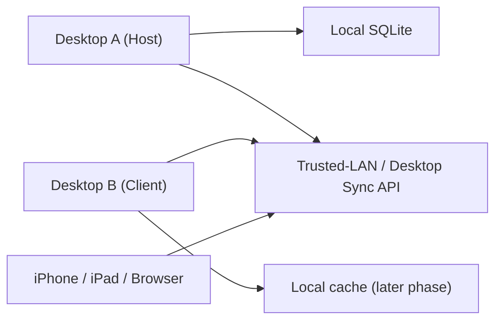

# Multi-Device Library Sync Design

## Summary

Filament Manager now has both macOS and Windows desktop clients. The next practical step is not
full peer-to-peer database sync, but a single-library model where one desktop instance acts as the
library host and other devices connect to it as clients. This keeps one source of truth for a
library while still allowing each installation to be configured as `Standalone`, `Host`, or
`Client`.

The current implementation now establishes:

- a role model per installation
- a persistent library identity
- a stored target host URL for client mode
- UI to manage those settings in the desktop app
- an explicit linking step where a client can adopt the checked host `library_id`
- host health checks and read-only host snapshots
- cached fallback for dashboard, inventory, printers, and loans
- desktop client pairing for protected host writes
- an initial set of routed writes from client to host

This still intentionally avoids direct database replication and multi-master sync.

## Goals

- Support both Windows-first and macOS-first households without hard-coding one platform as host.
- Keep one writable source of truth per library.
- Build on the existing trusted-LAN/web companion architecture instead of inventing a separate sync
  stack.
- Allow later rollout of desktop client connections, offline cache, and host migration in small
  steps.

## Non-Goals

- No multi-master sync.
- No direct SQLite replication between machines.
- No background merge/conflict engine.
- No automatic host failover in the first release.

## User Model

Each installation can be in one of three modes:

1. `Standalone`
   - Local-only library.
   - No external host is used.
   - This matches current behavior.

2. `Host`
   - This device owns the writable library for a specific `library_id`.
   - Other devices can later connect as clients.
   - The local DB remains authoritative.

3. `Client`
   - This device connects to another device that hosts the library.
   - It stores the host URL and library identity locally.
   - Later phases will add read/write API-backed flows plus offline cache.

## Why Single-Host First

The database contains high-conflict state:

- spool status
- printer slot assignments
- loan lifecycle
- usage history
- “empty” / “lost” lifecycle transitions

Trying to merge two writable databases would create unnecessary risk early. A single active host per
library avoids conflict resolution while still giving real multi-device value.

## Architecture Direction

### Host

- Owns the live SQLite database.
- Exposes an authenticated API.
- Reuses as much of the existing trusted-LAN transport and pairing model as possible.

### Client

- Connects to a chosen host URL.
- Uses API calls instead of owning authoritative state.
- Keeps a read-only cache of last successful host reads for dashboard, inventory, printers, and
  loans.
- Uses desktop pairing before protected write actions are allowed.

## Persistent Settings Model

The first batch stores sync metadata in the existing `settings` table:

- `library_sync_mode`
- `library_sync_device_name`
- `library_sync_library_id`
- `library_sync_host_base_url`
- `library_sync_host_device_name`

These settings are intentionally lightweight and safe to add without schema churn.

## Library Identity

Each library gets a stable `library_id`.

- `Standalone` and `Host` generate/store a local library ID.
- `Client` stores the library ID it is linked to once pairing/connection is completed.

This ID later lets us:

- detect mismatched hosts
- support host migration
- prevent accidental cross-library writes

## Offline Strategy

Current direction:

- client keeps a local read-only cache of last successful sync
- UI shows `Live`, `Cached`, or `Offline`
- UI also shows `Updated` timestamps where cached or live host data is displayed
- writes are blocked while host is unavailable or the desktop client has not been paired

This is intentionally safer than queueing writes offline in the first sync rollout.

## Security Model

Current direction:

- keep host access behind the existing trusted-LAN/browser safety philosophy
- add desktop-to-desktop pairing instead of open unauthenticated LAN access
- store the connected host URL plus desktop client auth state locally on the client
- never expose SQLite directly over the network
- renew protected host sessions instead of falling back to unauthenticated writes

## Host Migration

Later phase, not part of the first batch:

- export host library state
- import on another device
- rebind clients to the new host
- preserve `library_id` during controlled migration

This gives users a practical “move library to another machine” path without multi-master sync.

### Early Handoff UX

Before fully automated host migration exists, the product can still support a practical handoff:

1. export a full backup on the current host
2. import that backup on the target machine
3. switch the target machine to `Host`
4. keep the same `library_id` on the target machine when it was already linked as a client

This is intentionally manual, but it is explicit, safe, and fits the existing backup/import tools.

## Implementation Phases

### Phase 1: Role Foundation

- Add persistent sync role settings.
- Add library ID persistence.
- Add desktop UI for `Standalone / Host / Client`.
- Store optional client host URL.

### Phase 2: Host API Shape

- Define desktop sync endpoints reusing companion/trusted-LAN patterns.
- Add host health/version/library identity checks.
- Add connection diagnostics in Settings.
- Add explicit “link to checked host” flow so a fresh client can adopt the remote `library_id`
  instead of failing forever on initial library mismatch.

### Phase 3: Desktop Client Read Path

Status: **mostly implemented**

- Client pulls inventory/dashboard/printer data from host.
- Show connection and sync status.
- Add read-only fallback if host is unavailable.

### Phase 4: Desktop Client Write Path

Status: **partially implemented**

- Route writes through host API.
- Keep local cache invalidation simple and explicit.

Current routed writes:

- update spool weight
- update spool tare weight
- update spool location/status details
- assign printer slot
- return outbound loan
- hand back inbound loan
- create outbound loan
- create/update/delete wishlist items
- stock from wishlist on the host
- create owned/manual/borrowed-in spools on the host
- create/update/delete printers on the host

Writes still intentionally left on the host UI for now:

- broader maintenance operations
- deeper printer maintenance and future diagnostics

### Phase 5: Host Migration

- Promote another machine to host through a guided export/import handoff.

## Current Deliverable Shape

The current sync MVP direction now includes:

- designspec
- backend persistence helpers
- Tauri commands for role/configuration, host validation, cached host reads, and initial write routing
- Settings UI for role selection, validation, linking, pairing, and early host handoff
- read-only client flows for dashboard, inventory, printers, and loans
- protected client-to-host write actions for high-value daily tasks
- client-side add-spool and wishlist administration routed to the host
- client-side printer creation/update/delete routed to the host

## MVP Boundary (post-QA)

After the current host/client QA pass, the intended boundary for the first desktop sync MVP is:

### Supported from a paired desktop client

- Read host-backed data for:
  - `Oversikt / Dashboard`
  - `Lager / Inventory`
  - `Printere / Printers`
  - `Utlån / Loans`
  - `Statistikk / Statistics`
- Fall back to cached host data on those pages when the host is temporarily unavailable.
- Run protected daily operations against the host:
  - update spool weight
  - update spool tare
  - update spool location
  - toggle spool lost/restore status
  - assign printer slots
  - create outbound loans
  - return outbound loans
  - hand back borrowed-in spools
  - add owned/manual/borrowed-in spools
  - create/update/delete wishlist items
  - stock wishlist items on the host
  - create/update/delete printers

### Still intentionally host-only

- broad maintenance/reset flows
- backup validation/import/export as routine client operations
- catalog refresh/repair and swatch maintenance
- direct SQLite movement or replication
- offline write queueing or conflict resolution
- multi-master editing

### Product meaning of the boundary

This milestone is meant to feel like **full remote daily administration** from a secondary desktop,
while still keeping the host as the only source of truth and keeping higher-risk maintenance flows
anchored to the host device.
