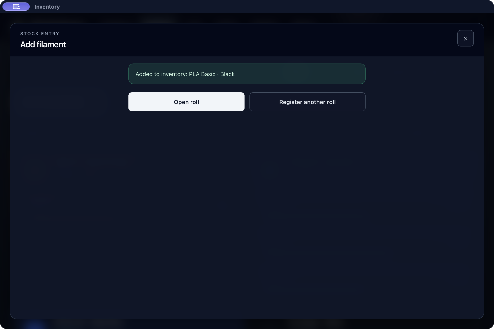

# Oppfølging av registrering – 6. september 2026

Vanlig registrering av én rull har fått en egen suksessvisning med «Åpne
rullen» og «Registrer en rull til». Endringen følger hypotesen om uklart neste steg
i [AI-evalueringen](USABILITY_AGENT_EVALUATION_2026-09-06.md). Evalueringen
observerte ingen dobbeltregistrering; dette er ikke dokumentasjon på en
målt brukerfeil eller forbedret menneskelig fullføringsrate.

## Endret atferd

- Etter bekreftet lagring erstattes registreringsfeltene av kvitteringen.
  «Åpne rullen» bruker akkurat den returnerte rull-ID-en. «Registrer en rull til»
  åpner en ny registreringsrunde uten å skrive noe til databasen.
- Kvitteringen inneholder rull-ID og bekreftelsestekst, uavhengig av den
  generelle statusmeldingen. Den er bundet til gjeldende registreringsrunde,
  bibliotek, Host og målgenerasjon. Svar eller handlinger fra en tidligere
  kontekst kan ikke åpne eller bekrefte en rull i en ny kontekst.
- En synkron innsendinglås stopper to kall før React rekker å rendre på nytt.
  En fullført runde forblir sperret for ny registrering frem til et eksplisitt
  nytt steg. Kvitteringen er tilstand i den åpne arbeidsflyten, ikke en
  vedvarende jobbkvittering som gjenopprettes etter appstart.
- Lokal registrering bruker den innsendte ID-en etter vellykket commit;
  Client bruker ID-en som Host genererer og returnerer. Lokale ID-er bruker
  nå UUID eller et tilfeldig suffiks i stedet for bare klokkeslett, slik at
  to runder ikke er avhengige av ulike millisekunder.
- Lagring og etterfølgende oppfriskning behandles separat. Når opprettingen
  er bekreftet, beholdes kvitteringen og sperren selv om lager- eller
  kataloglesingen feiler. Lesefeilen gir ikke en ny registreringsforespørsel.
  Dette gir ingen idempotensgaranti ved ukjent utfall av selve Host-skrivingen.

## Atomisk registrering av innlånt katalogrull på Host

Gjennomgangen fant en separat backendfeil: Host opprettet en innlånt
katalogrull med lån, og oppdaterte lokasjonen i en etterfølgende transaksjon.
En ugyldig lokasjon kunne dermed gi et feilsvar etter at rullen allerede
var lagret, uten at svaret inneholdt den nye ID-en.

Ruten sender nå både hjemme- og nåværende lokasjon inn i den eksisterende
opprettingstransaksjonen. Lokasjon, rull, innlån og historikk lagres sammen.
Dette endrer ingen skjema-, capability- eller feltkontrakt.

En API-regresjon feilet mot den opprinnelige ruten fordi en avvist lokasjon
etterlot endrede lagerdata. Etter rettelsen passerer testen: ugyldig lokasjon
og en fremprovosert sen historikkfeil bevarer alle kontrollerte katalog-,
rull-, låne-, lokasjons-, historikk- og revisjonsrader. Vellykket registrering
returnerer ID-en til riktig rull med begge lokasjonspekere og ett innlån.
Den eksisterende API-testen for manuell innlånsregistrering passerer også.

## Verifisering

| Kontroll | Status |
| --- | --- |
| Fokusert API-regresjon og eksisterende innlånsregistrering | Bestått lokalt; rød/grønn bekreftelse beskrevet over. |
| Rust-formattering og diffkontroll | Bestått lokalt. |
| `npm run smoke` på siste kode | Bestått: bygg, lint, 392 Companion-, 774 script-, 1578 UI- og 23 ytelsestester, tilgjengelighetsporter, kontrakter og doctor. |
| `npm run test:rust` | Bestått: formattering, tester og Clippy i dev/release. De to delene av `verify` er kjørt separat. |
| Fokuserte nettleserregresjoner | Bestått: samtidige innsendinger, fullført runde, UUID, Host-ID, mål-/sesjonsbytte, feil etter lagring, bevart kvittering, eierskapsnullstilling og tastaturfokus. |
| Språkkontroll | Alle 21 desktop-kataloger har de nye tekstene. Bygg og runtime-/artefaktkontroll bestått; ingen ny morsmålsgodkjenning eller visuell kontroll av alle språk. |
| Native registrering | Manuell registrering og eSUN-innlån fullført med uavhengig SQLite-kontroll. Bambu-flyten kontrollert på siste native bygg etter fokusrettelsen. |

## Native observasjoner

Tre kjøringer brukte hver sin nye kopi av den syntetiske testdatabasen,
med eget testapp-ID og eksplisitt databasebane. Skjemaoppgradering ble
fullført før førbildene. Native visning ble kontrollert på macOS arm64,
engelsk språk, mørkt tema og 1200 × 800 vindu. Disse lokale kjøringene
verifiserer ikke en native Client koblet til Host; Host-ruten er dekket
av API-regresjonen over.

- **Manuell rull:** To eksplisitte lagringer av Generic PETG «Registration QA
  · Slate Grey», 750 g, ga nøyaktig to nye ruller med begge lokasjonspekere
  til «QA Dry box». «Registrer en rull til» beholdt filamentfelter og vekt,
  tømte lokasjonsfeltet og skrev ingenting. «Åpne rullen» åpnet akkurat
  den andre UUID-en. Hele tabellsettet var identisk før og etter hver av
  disse to navigasjonshandlingene.
- **Innlånt eSUN-rull:** PETG+HS · Deep Blue, 850 g, ga én ny innlånt rull,
  ett aktivt innlån for «QA owner» og to historikkhendelser. Begge
  lokasjonspekere viste «QA Dry box». Bekreftelsen beholdt innlånsteksten,
  og den åpnede rull-ID-en samsvarte med databasen.
- **Siste bygg:** Etter en fokusrettelse ble appen bygget på nytt. En ny
  Bambu PLA Basic · Black på 1000 g ble registrert. «Åpne rullen» fikk
  fokus; Tab nådde «Registrer en rull til», og Shift+Tab/Enter åpnet
  riktig rull. Kvitteringen forble synlig etter den generelle
  statusmeldingens 20-sekunders levetid. Den midlertidige fasen mens
  lagring/oppfriskning pågår er kontrollert med forsinkede svar i
  nettlesertestene: fokus forblir i dialogen.

De første to native kjøringene ble gjort før den siste endringen som
holder fokus i dialogen under arbeid. Registrerings-, datakilde- og
backendkoden var identisk. Siste Bambu-kjøring og den samlede `smoke`-
kontrollen bruker også fokusrettelsen. Databasesammenligningene kontrollerer
forventede nye rader, at tidligere rader og øvrige tabeller er urørt,
`quick_check`, fremmednøkler og at resultatet er stabilt etter appavslutning.

Private før-/etterbilder av databasen, mellomkontroller, loggfiler,
kjøringsmanifest og binærhash er beholdt utenfor repoet. Skjermbildet over
viser bare syntetiske testdata. Ingen ny Windows-kjøring inngår.

Ingen nye menneskelige tids- eller fullføringsmålinger inngår. Målene i
[deltakerprotokollen](USABILITY_TEST_PROTOCOL.md) er fortsatt umålte.

## Neste avgrensede arbeid: Bambu-batch

Bambu-batch oppretter fortsatt rullene én etter én. Hvis første rad lykkes
og neste feiler, beholdes den første i databasen mens hele batchutkastet
fortsatt kan sendes på nytt. Nye ID-er kan da opprette de bekreftede radene
en gang til. Dette er et konkret kodefunn; det ble ikke observert som en
brukerfeil i AI-evalueringen og er ikke rettet i denne leveransen.

Neste oppgave skal skille bekreftede rader med autoritativ ID fra rader som
ikke er forsøkt og rader med ukjent utfall. Bekreftede rader skal ikke sendes
på nytt. Et avbrutt Host-svar må ikke behandles som bevis på at ingen rull
ble lagret. Gjenbruk av lokale ID-er løser ikke dette alene, siden Host
genererer sine egne. En eventuell atomisk batch eller sikker gjenopptakelse
må avklares som en egen backend-/Host-kontrakt før den loves i UI-et.
