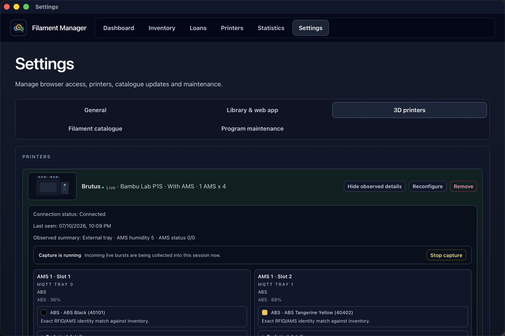
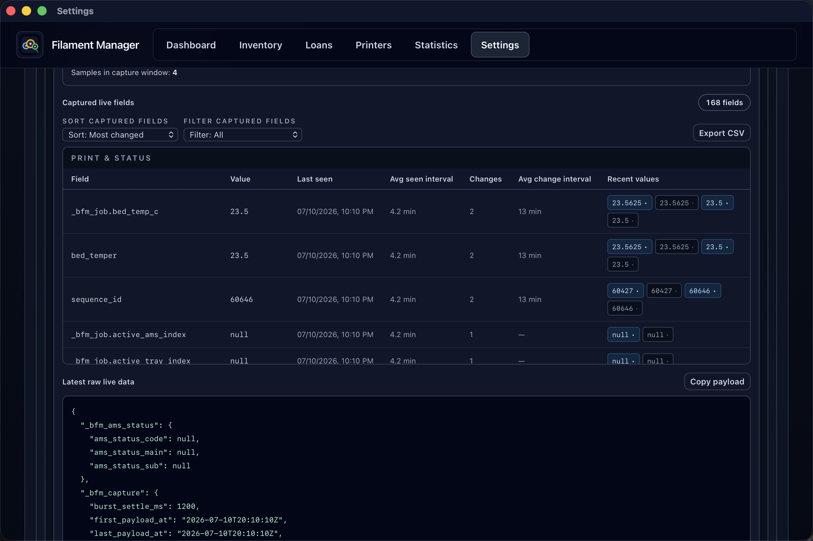
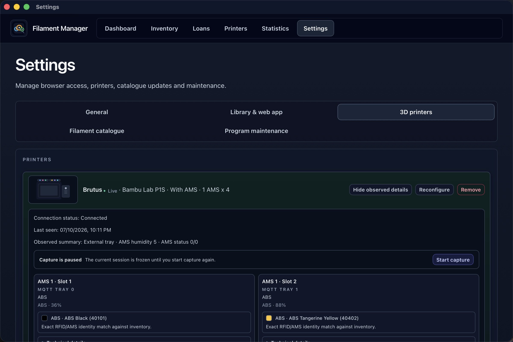

# Screenshot Tour

This page is a visual product tour for Filament Manager. It complements the
text guides by showing the main desktop workflows and the Companion webapp on
wide, tablet, and phone screens.

The Companion/webapp server must be enabled, and the desktop app needs to stay
running for Companion to work from a phone, tablet, or workshop browser.

The v0.20.1 captures use the English dark theme and a rich temporary copy of a
real local library. Printer, RFID, and Bambu diagnostics captures wait for live
telemetry before the image is accepted; the source library is not modified.

## Quick Preview

  
  
  
  
  
  
  
  
  

## Desktop App

### Dashboard

Inventory health, printer activity, low-stock signals, recent activity, and
library/webapp status in one overview.

### Inventory

Searchable spool cards with remaining weight, location, material/vendor badges,
ownership, and low-stock state.

### Add Filament

Catalog-backed stock entry for Bambu, eSUN, and generic/manual rolls. This
tour uses eSUN for ordinary manual stock entry so the flow is recognizable even
when a roll is not read automatically from a Bambu AMS.

### Batch Add From Bambu Boxes

Batch entry lets you paste or scan several Bambu Filament Codes, review
ambiguous rows, choose among discontinued old-stock matches when needed, and add
all ready matches in one action.

### Wishlist And Orders

Status filters, search, result counts, stocking, and removal keep planned
purchases manageable from the same Add filament workspace.

### Filament Details

Roll-level maintenance for weight, tare, home location, ownership, QR companion
links, RFID, live AMS sighting, and lost-status handling.

### Roll History

Roll history stays collapsed until needed, then shows a localized event timeline
with bounded expansion for long histories.

### RFID Capture

RFID capture compares the live AMS identity with catalog and inventory data,
shows raw captured fields, and lets you save the RFID to the selected spool.

### Loans

The loan history tracks outgoing loans, borrowed-in rolls, returns, and CSV
export from the same place.

### Loan Out

Loan-out keeps the available roll list and the selected roll/action panel side
by side, using the roll swatch color through the list, preview, and action
surface.

### Return Loan

Return handling records measured return weight, calculates consumed filament,
and moves the roll back into stock or completes borrowed-in handback history.

### Return Borrowed-In Filament

The inbound return flow confirms the external owner, measured hand-back weight,
and removal of the borrowed spool from active inventory.

### Printers

Printer and AMS slot state with live Bambu observations, current assignments,
collapsed slot swatches/material labels, weight updates, RFID matching, and
candidate suggestions.

### Add Printer

Printer setup chooses model, name, and multi-material capacity before optional
local Bambu Live credentials are configured.

### Slot Assignment

Slot assignment filters compatible rolls, shows placement and remaining weight,
and keeps the current slot context visible while changing assignment. With
Bambu Live and Bambu RFID filament, much of this can be observed from the
printer; other filament brands can still be assigned and weighed manually when
you want usage and remaining weight to stay accurate.

### AMS Catalog Onboarding

When the AMS reports a Bambu roll that is not yet in inventory, catalog
onboarding can create the spool and save the observed RFID in one guarded flow.

### Slot Replacement Weight

Replacing a loaded non-Bambu spool records outgoing and incoming measured
totals so remaining filament and usage stay accurate when the printer cannot
automatically identify or weigh the roll.

### Slot Clear Weight

Clearing a loaded non-Bambu slot records the outgoing measured total and
returns the spool to its home location when it is no longer loaded.

### Statistics

Material use, printer activity, ownership split, loan consumption, and filtered
breakdowns across manual jobs and live printer usage.

### Loan Usage Statistics

Loan statistics separate active and returned movements, borrower usage, and
material consumed outside printer sessions.

## Settings

### General

Version, license/source links, language, appearance, documentation links, and
printable inventory overview tools.

### Library And Web App

Host/client library mode and local Companion/webapp controls. Companion must be
enabled and running here before a phone, tablet, or workshop browser can use the
LAN Companion address.

### Guided Library Role Change

Changing between Standalone, Host, and Client opens a guided review. Nothing is
saved until the migration impact and required backup or connection details are
confirmed.

### Bambu Live Diagnostics

Bambu Live diagnostics show connection health, observed AMS slots, matching
signals, and the live field capture session used while evaluating printer data.

### Captured Live Fields

Captured field tables expose raw live printer fields, recent values, change
counts, and export controls for debugging AMS/printer behavior.

### Paused Capture

Live capture can be paused to freeze the current diagnostic session while still
showing the last observed printer and AMS state.

### Unsaved Printer Changes

Printer reconfiguration keeps save state visible and asks before discarding
unsaved model, capacity, name, or Bambu Live changes.

### Filament Catalogue

Catalogue settings group vendor catalogues, material filters, missing swatches,
and refresh/maintenance actions.

### Program Maintenance

Backup validation, import/export, reset actions, and other local maintenance
tools live in the maintenance tab.

## Companion Webapp

Companion is a local webapp served by the desktop app on the same LAN. Enable
the Companion/webapp server in **Settings -> Library & web app**, pair the
browser if required, and keep the desktop app running while using Companion from
a phone, tablet, or workshop browser.

### Wide Companion

The wide Companion view is useful for a workshop browser or secondary screen
when you want quick stock, printer, and loan access away from the desktop app.

### Companion Tablet

Tablet layout keeps the inventory readable with touch-friendly rows, swatches,
remaining weights, and quick actions.

### Companion Phone

The phone inventory view is optimized for fast lookup near the printer, with
stacked rows and large touch targets.

### Phone Add Spool

Companion can add owned or borrowed-in stock from the browser when the desktop
host allows writes for the paired browser.

### Phone Lend Spool

The lending sheet keeps the selected roll, borrower, outgoing weight, and note
fields in a compact phone flow.

### Phone Detail

The detail sheet exposes current roll metadata, history, usage, status, and
maintenance actions in the mobile Companion.

### Phone Printer Board

The phone printer board shows AMS slots, loaded rolls, live observations, and
slot actions in the Companion view.

