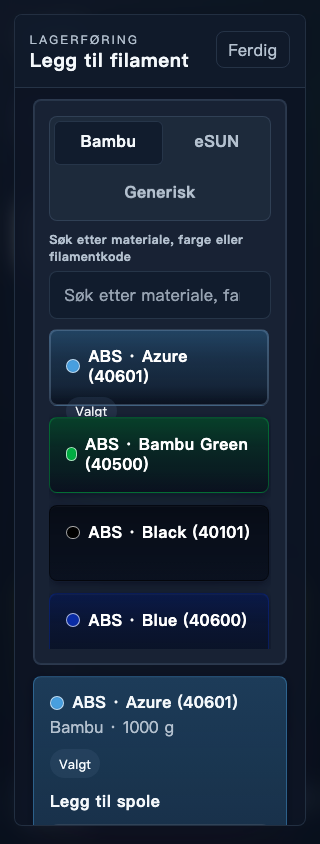
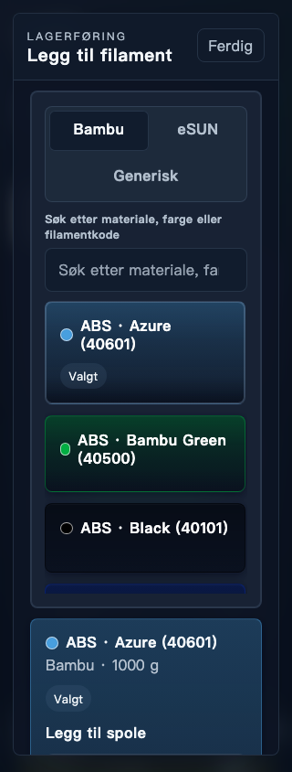

# UI- og brukervennlighetsvurdering, 19. september 2026

Fire runder med en separat kritikeragent og implementering i Filament Manager.
18 av 19 vurderte lokale områder endte på minst 8/10. Bibliotek/webapp endte
på 7,95, og datatilkoblet native Client har ingen karakter. Hele oppdragets
brede mål er dermed ikke dokumentert oppnådd; observerte konkrete feil er rettet.
Dette er en agentbasert ekspertvurdering med oppgavetesting, ikke en undersøkelse
av faktiske sluttbrukere. Ingen brukersuksessrate eller tidsbesparelse er målt.

## Testgrunnlag

Baseline er `ab2d860a` på PR #131. Evalueringen bruker et eget macOS-utviklingsbygg
med separat app-ID, isolerte nettleserpreferanser og syntetisk SQLite-bibliotek.
Companion kjører mot samme virkelige HTTP/backend på loopback. Vite leverer
skrivebordsgrensesnittet; Companion er kompilert inn i testappen. Dette er ikke
godkjenning av en signert distribusjonspakke eller ny release.

Første runde hadde åtte ruller, to printere, utlån, ønskeliste og 1612 katalograder.
Andre runde utvidet biblioteket til 190 ruller: 167 på lager, fire tildelte, elleve
tomme, ett utlånt og sju mistede. Det hadde 41 manglende priser, 74 EUR-priser og
75 NOK-priser, lange navn, ulike materialer, nyere historikk og lav beholdning.
Antall endret seg deretter gjennom registrering, mottak og statusoppgaver.
Endringer ble kontrollert både i UI etter gjenåpning og med lesing av SQLite.

Første fixture hadde usammenhengende slot-/rullstatus; dette ble rettet i den
isolerte kopien. En feilaktig ISO-tidsstempelverdi i et kalenderdatofelt i den
utvidede fixturen er også skilt fra produktfunn. Ingen av disse gir produktfeil
eller kunstig poenggevinst. Rikere data betyr at nye funn i senere runder ikke
nødvendigvis er regresjoner.

Native macOS-vindu var faktisk ca. 1229×768 på tilgjengelig skjerm. Companion ble
observert i Chromium ved 320, 390 og 768 piksler bredde. Frakobling ble simulert i
nettleserkonteksten; HTTP 500 ble simulert på en konkret inventory-request. Vanlige
lagringsoppgaver brukte virkelig backend. Ingen fysiske printere ble styrt.

## Bedømmelse og runderapporter

Kriterier: oppgaveløsning 25 %, informasjon 20 %, navigasjon 15 %, tilbakemelding
15 %, visuelt hierarki 10 %, tilgjengelighet 10 % og robusthet 5 %. Vektet score
avrundes ikke opp til målet. 1–2 betyr ubrukelige kjerneoppgaver, 3–4 store hindre,
5–6 tydelig friksjon, 7 godt brukbart, 8 gjennomarbeidet, 9 svært godt i krevende
tilstander og 10 eksepsjonelt med bred dokumentasjon. En sentral oppgave som
feiler, misvisende data eller alvorlig datatap kan aldri godkjennes via snittet.

Fullstendige kriteriescorer, reproduksjon, akseptanse og avgrensninger finnes i
[runde 1](ui-review-2026-09-19/round-1.md),
[runde 2](ui-review-2026-09-19/round-2.md),
[runde 3](ui-review-2026-09-19/round-3.md) og
[runde 4](ui-review-2026-09-19/round-4.md).
Videreførte karakterer er eksplisitt merket; de betyr ikke ny testdekning.

## Gjennomførte forbedringer

- Companion-knappen for lagring av tom rullvekt var koblet til en manglende
  submit-handler. Den lagrer nå, gir tilbakemelding og beholder verdien etter reload.
- Utlån, retur, veiing og printeroperasjoner viser beregningen fra gjeldende
  totalvekt og tara før lagring. Ugyldige utkast vises som ugyldige; fokus og
  øvrige felter bevares. Skrivebordsutlån forklarer nå totalvekt og viser netto.
- Companion avviser desimaler, eksponentnotasjon og heltall utenfor sikkert
  område, i stedet for at `parseInt` kan avkorte for eksempel `1e3` til ett gram.
  Preview og innsending bruker samme validering.
- Lånevelgeren i Companion søker hele listen før grensen på 150 synlige kort,
  viser antall treff og beholder søkefeltet ved null treff. Felt og kort følger
  eksisterende utforming og har kontrollert mobilrendering.
- Native lager viser printer-/slotnavn. Lånevelgere og Companion-printerdialoger
  viser navngitte lokasjoner fremfor interne ID-er; legacyverdier har fallback.
  Ett native søkeresultat strekkes ikke lenger til hele panelhøyden.
- Companion skiller en utilgjengelig forbindelse fra HTTP-feil og varsler når
  tidligere lastede data kan være utdaterte. Vellykket oppdatering rydder varselet.
- Mobilfaner brytes mellom ord, valgt katalogkort rommer hele innholdet, og
  printerkort viser færre gjentatte statusetiketter.
- Vanlig backupeksport bekrefter eksport og validering uten å love at en ny
  rolleveiviser kan hoppe over sin egen ferske backupkontroll.

Kjent designspråk, domeneregler og sikkerhetsgrenser er bevart. Ingen generell
ombygging av dashboard ble begrunnet av oppgavene. Ny tekst om utdaterte data er
lagt inn i alle 21 Companion-kataloger, med oversetterkontekst. Maskinelle
språkkontroller er ikke det samme som morsmålsreview.

## Dekning og begrensninger

| Område | Faktisk kontroll | Begrensning |
|---|---|---|
| Oversikt | Rik data, sjekkliste, lav beholdning → riktig lagerfilter | Ingen fysisk telemetri |
| Lager | Søk, stor liste, kort/plassering, EMPTY skjult i All og synlig i Empty | Ikke alle sorteringskombinasjoner |
| Registrering/detalj | Native katalogregistrering, Companion generisk, lokasjon, tara, veiing, status, etikettpreview | Kamera, fysisk QR/etikettutskrift og alle bulkvarianter ikke verifisert |
| Lokasjoner | Opprett, omdøp, arkiver, gjenopprett; bruk ved registrering | Ingen permanent sletting |
| Utlån/retur | Native og Companion, søk, total/netto, lagring, retur og historikk | Ikke alle sjeldne kombinasjoner |
| Ønskeliste/bestilling | Status, delmottak, ny rull, pris og gjenværende antall | Eksterne bestillinger ikke utført |
| Printere | Syntetiske slots, last, oppdater vekt, tøm, etterfølgende historikk | Fysisk Bambu/Prusa/RFID og firmware ikke verifisert |
| Statistikk | Perioder, custom range, søk/reset, detaljgrunnlag, blandet valuta, manglende priser og kostnadssporing | Prognosens overpresisjon er et mindre restpunkt |
| Generelt | Språk, lyst/mørkt tema | OS-autostart og installasjon av oppdatering ikke testet |
| Filamentstandarder | Valuta, terskel, prisgruppe, kun manglende priser, kvittering og persistens | Alle overwrite-/Client-kombinasjoner ikke observert |
| Bibliotek/webapp | Companion, eksport/validering, veiviser, kansellering og isolert Host-rolle | Full manuell Client-parring ikke verifisert |
| Printerinnstillinger | Navn, utkast, kansellering/behold og lagring | Maskinvarekonfigurasjon ikke fullt testet |
| Katalog/import | Søk, ugyldig/gyldig fargekode og lagring | Ekstern leverandørimport ikke kjørt |
| Vedlikehold | Full eksport, automatisk og manuell validering | Restore/reset/repair/restart ikke utført i kritikerens UI-runder |
| Client | Egen isolert app startet; dedikert integrasjonstest rapporteres separat | CUA-målretting og vanlig HTTP-loopback-parring hindret full datatilkoblet manuell UI-vurdering; ingen score |
| Tilgjengelighet | Observerte etiketter, tekstlig status, fokus, søk og mobilbredder; automatiserte a11y-kontroller | Ingen full WCAG-revisjon, VoiceOver eller faktisk mobilnettleser |
| Plattform | macOS native og Chromium Companion | Windows/Linux ikke manuelt verifisert |

Vanlig Client-parring avviser usikret loopback med hensikt. Testspesifikke
unntak finnes bare i den avgrensede integrasjonsharnessen. Vi endrer ikke
produktets sikkerhetspolicy for å oppnå en høyere evalueringsscore.

## Utvalgte før-/etterbilder

Bildene bruker syntetiske data. Andre runde avdekket et valgt katalogkort som
ikke rommet teksten ved 320 px; avsluttende kontroll viser hele kortet:

| Før (R2, 320 px) | Etter (R4, 320 px) |
|---|---|
|  |  |

[Opprinnelig utdatert låneberegning](ui-review-2026-09-19/loan-before.png),
[ferdig lånesøk med lokasjonsnavn](ui-review-2026-09-19/loan-search-after.png) og
[printerdialog med faktisk netto-/taraberegning](ui-review-2026-09-19/printer-after.png).
Runderapportene viser også navnene på øvrige lokale artefakter under
`tmp/ui-review/evidence/critic-r1` til `critic-r4`; disse er ikke alle sjekket inn.

## Neste avgrensede arbeid

Fullfør en manuell datatilkoblet native Client-vurdering i et støttet nettverksoppsett,
med rollebegrensede innstillinger, frakobling/gjenoppretting og riktig bibliotek.
Deretter prioriter reelle enheter/plattformer og import etter faktisk bruk.
Prognosens svært presise langtidsestimat er et mindre forbedringspunkt.
Ingen femte kritikerrunde eller release inngår i denne pakken.

## Validering av levert pakke

| Kontroll | Resultat |
|---|---|
| `npm run smoke` | Bestått: UI-build/lint, 401 Companion-tester, 896 skripttester, 2050 UI-tester, 23 ytelses-/kontrakttester, a11y, fem lånedialogscenarier og prosjektkontrakter/doctor |
| Siste målrettede Companion-kontroll | 401 bestått etter lokasjonsnavnrettelsen; riktig locale-preload brukt |
| Native utviklingsbygg | `cargo build -p bambu-filament-manager` bestått med separat test-ID |
| Companion mot faktisk backend | Registrer/finn/tomvekt/reload, veiing, slotlasting/tømming, ønskelistemottak og utlån/retur bestått på ny syntetisk database |
| Companion persistensbevis | Tomvekt 200 beholdt etter reload, måling 777 lagret, retur 900 lagret, lån RETURNED, slot tømt, ønskeliste delmottatt med to igjen |
| Dedikert Host/Client-harness | Bestått med testbygget: parring, skrivehandling, offline, gjenoppretting og credential-opprydding. Host 760 g, separat lokal Client-rull uendret 333 g |
| Språk | Alle 21 kataloger generert/kompilert; key-, fallback-, runtime- og readiness-kontrakter bestått. Ny fingerprint-bundet maskinell QA-post; ingen ny morsmålsgodkjenning påstås |
| `git diff --check` | Bestått |

Den ekstra reload-testen for tomvekt ble først begrenset med HTTP 429 under
maskinrask gjentatt innlasting av modulene. En eksplisitt pause i det utvidede
E2E-scenariet lar serverens eksisterende 240 forespørsler/minutt-grense bestå.
Den nye kjøringen passerte. En direkte kjøring av noen Companion-testfiler uten
prosjektets locale-preload ga språkfeil; ordinær `npm run test:companion` er den
korrekte kommandoen og passerte. Slike testoppsettsfeil er ikke telt som nye
produktforbedringer.

Host/Client-harnessen ble kjørt med det egenbygde testprogrammet via
`run-packaged-host-client-e2e.mjs`; navnet på verktøyet innebærer ikke at en ny
signert releasepakke ble testet. Den avgrensede automatiserte integrasjonen
lukker ikke hullet i kritikerens manuelle Client-UI-vurdering.
