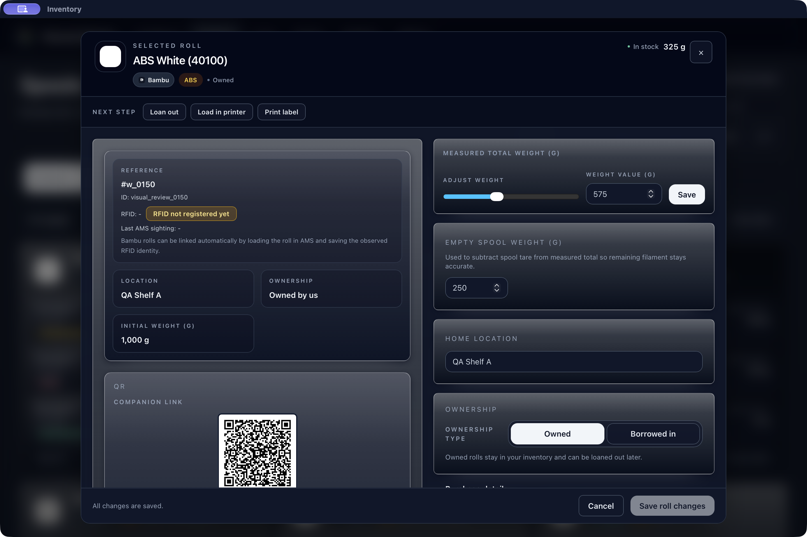
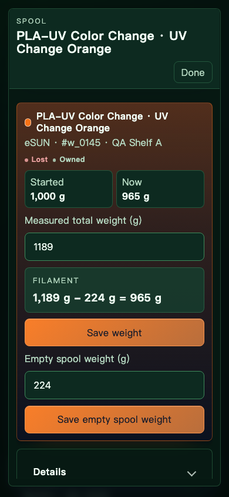
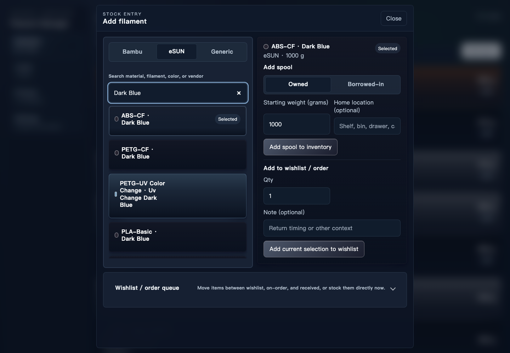
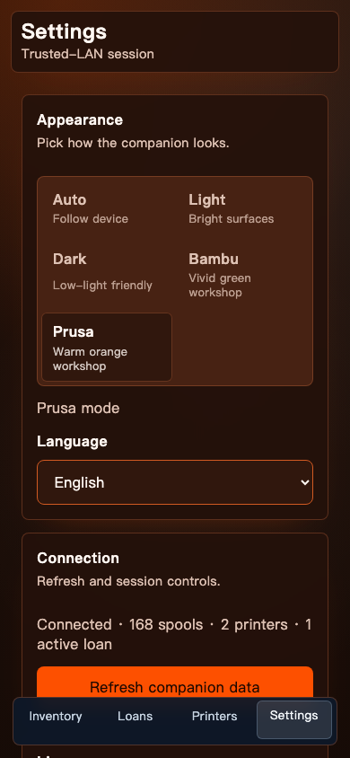
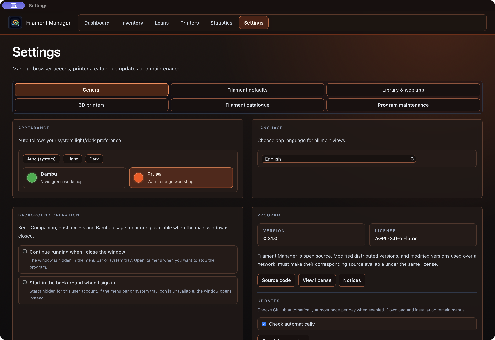

# Visuell kritikk — runde 1

**Ikke godkjent.** Dette er en første, avgrenset baseline som gir prioritet til felles forbedringer. Det er ikke full dekning av produktet. Ingen tidligere 8/10-vurderinger er brukt som dagens karakterer. Ingen produktendringer ble gjort under inspeksjonen.

## Faktisk inspeksjon

Kritikeren navigerte den kjørende native appen `Filament Visual Review.app` gjennom CUA, åpnet hvit ABS-rull, statistikk med faktisk historikk og General, og byttet gjennom de fire eksplisitte temaene. Appens opprinnelige valg var **Auto med mørkt systemutfall**; første observasjoner omtalt muntlig som «dark» er derfor registrert korrekt som Auto-dark her. Etterpå ble samme hvite detalj åpnet i eksplisitt Dark og arkivert. Testbiblioteket hadde 168 syntetiske ruller, 157 i normal liste, svarte/hvite/oransje filamenter, lave beholdninger, to printere, utlån og printjobber over flere måneder. Ingen fysisk printer ble kontaktet.

Native skjermfangst målte vindu 1440×992, inkludert tittelfelt; CUA viste innholdsområdet ved omtrent 1440×960, Retina 2×. Companion ble kjørt mot faktisk loopback-backend på 4285 gjennom eksisterende screenshot-gate. **Alle 36 genererte Companion-PNG-er ble åpnet og visuelt inspisert individuelt**, ikke godkjent ut fra gate-resultatet. Gate returnerte ingen maskinelle feil for de inkluderte scenariene. Printer-scenarioene var eksplisitt utelatt fra denne første fangsten fordi de har live-readinesskrav; de er fortsatt ikke evaluert.

| Flate | Faktisk observerte temaer | Skjerm/tilstand |
|---|---|---|
| Native navigasjon + oversikt | Auto-dark | Befolket, printeradvarsel, setup, nøkkeltall |
| Native lager | Auto-dark | 157 ruller, gruppert liste, hvite/svarte/oransje kort |
| Native hvit rull-detalj | Auto-dark og Dark | Åpnet fra lager, metadata, vekt/tare, QR, footer; Escape lukket |
| Native statistikk | Auto-dark | Oversikt, verdier/datamangler og prognose scrollet frem |
| Native General | Auto-dark, Dark, Light, Bambu, Prusa | Temavelger, språk, bakgrunn, program; temabytte og kvittering |
| Companion lager, add-spool, detalj, utlån, retur og innstillinger | Dark | Hver flate 1440×1000, 834×1112, 390×844 |
| Companion samme seks flater | Light, Bambu, Prusa | Hver flate 390×844 |

Fangstoversikten i [round-1-capture-manifest.json](round-1-capture-manifest.json) inneholder filnavn og SHA256. Fullsettet ligger lokalt under `tmp/visual-modernization/critic-r1/`. Representative bilder er arkivert i rapportmappen. Native øvrige observerte bilder og AX-trær finnes i kritikerens CUA-verktøylogg; ingen arkivert fil er påstått for dem.

## Karakterer

Vektorer følger brukerens ti kriterier: **H** hierarki, **T** typografi, **L** layout/tetthet, **F** farge/kontrast/tema, **K** konsistens, **V** komponentfinish, **I** interaksjon/feedback, **R** responsivitet, **D** krevende data, **A** praktisk bruk/tilgjengelighet. «IE» er ikke evaluert, aldri «ikke relevant» eller godkjent. Tall beskriver bare de eksplisitt observerte tilstandene. Ingen gjennomsnitt brukes.

| Flate / tema | H | T | L | F | K | V | I | R | D | A | Begrunnelse |
|---|---:|---:|---:|---:|---:|---:|---:|---:|---:|---:|---|
| Native oversikt / Auto-dark | 7 | 8 | 6 | 8 | 8 | 8 | 8 | IE | 7 | 7 | F01: oppsett og én advarsel skyver nøkkeltall ned |
| Native lager / Auto-dark | 8 | 8 | 7 | 7 | 8 | 7 | 8 | IE | 8 | 7 | F02/F07: tung dataglans og omfattende chrome |
| Native hvit detalj / Auto-dark | 8 | 7 | 7 | 5 | 7 | 7 | 8 | IE | 7 | 5 | F02: tekst på lyse gradienter; ekte swatch tydelig |
| Native hvit detalj / Dark | 8 | 7 | 7 | 5 | 7 | 7 | 8 | IE | 7 | 5 | Samme problem faktisk gjenåpnet/arkivert |
| Native statistikk / Auto-dark | 8 | 8 | 7 | 8 | 8 | 8 | 8 | IE | 7 | 7 | F05/F07: overpresis prognose, mye gjentatt innramming |
| Native General / Auto-dark | 8 | 8 | 7 | 8 | 8 | 8 | 7 | IE | 8 | 8 | F07: høyt kort for ett språkfelt, tung navigasjon |
| Native General / Dark | 8 | 8 | 7 | 8 | 8 | 8 | 7 | IE | 8 | 8 | F07: kvittering skyver innholdet ned |
| Native General / Light | 8 | 8 | 7 | 8 | 8 | 8 | 7 | IE | 8 | 8 | God lesbarhet; F07 og flere sterke rammer |
| Native General / Bambu | 8 | 8 | 7 | 8 | 8 | 8 | 7 | IE | 8 | 8 | Valgt/fokusflate tydelig; F07 |
| Native General / Prusa | 8 | 8 | 7 | 8 | 8 | 8 | 7 | IE | 8 | 8 | Egen varm palett; F07 |
| Companion lager / Dark | 8 | 8 | 7 | 8 | 8 | 7 | 8 | 8 | 8 | 8 | Store rader på bred skjerm, glans; status med tekst |
| Companion add / Dark | 7 | 8 | 6 | 8 | 7 | 7 | 8 | 7 | 7 | 7 | F03/F04, innsnevret tekstkolonne på wide |
| Companion detalj / Dark | 8 | 8 | 7 | 7 | 7 | 7 | 8 | 8 | 8 | 8 | F03: datafarget Save; tydelig total−tara=netto |
| Companion utlån / Dark | 8 | 8 | 8 | 7 | 7 | 8 | 8 | 8 | 8 | 8 | F03: datafarget CTA; felter og beregning lesbare |
| Companion retur / Dark | 8 | 8 | 7 | 8 | 8 | 8 | 8 | 7 | 7 | 8 | F04: navn gjentas, smal navneboks, mobilsubmit under fold |
| Companion innstillinger / Dark | 8 | 8 | 8 | 8 | 8 | 8 | 8 | 8 | 8 | 8 | Lesbar og ryddig, men store tomme wide-kort |
| Companion lager / Light | 8 | 8 | 8 | 8 | 8 | 8 | 8 | 8 | 8 | 8 | Swatchkant bevarer hvitt/svart; phone observeres |
| Companion add / Light | 7 | 8 | 6 | 8 | 7 | 7 | 8 | 7 | 7 | 7 | F03/F04 gjelder i faktisk Light-fangst |
| Companion detalj / Light | 8 | 8 | 7 | 7 | 7 | 7 | 8 | 8 | 8 | 8 | F03, oransje Save på lys flate |
| Companion utlån / Light | 8 | 8 | 8 | 7 | 7 | 8 | 8 | 8 | 8 | 8 | F03 |
| Companion retur / Light | 8 | 8 | 7 | 8 | 8 | 8 | 8 | 7 | 7 | 8 | F04 |
| Companion innstillinger / Light | 8 | 8 | 8 | 8 | 8 | 8 | 8 | 8 | 8 | 8 | Tydelig tekst/felt, phone observeres |
| Companion lager / Bambu | 8 | 8 | 8 | 7 | 7 | 7 | 8 | 8 | 8 | 8 | F06: bunnav er blågrå |
| Companion add / Bambu | 7 | 8 | 6 | 7 | 7 | 7 | 8 | 7 | 7 | 7 | F03/F04 |
| Companion detalj / Bambu | 8 | 8 | 7 | 7 | 7 | 7 | 8 | 8 | 8 | 8 | F03, oransje CTA midt i grønn chrome |
| Companion utlån / Bambu | 8 | 8 | 8 | 7 | 7 | 8 | 8 | 8 | 8 | 8 | F03 |
| Companion retur / Bambu | 8 | 8 | 7 | 7 | 7 | 8 | 8 | 7 | 7 | 8 | F04, blå datatint mot store grønne felt |
| Companion innstillinger / Bambu | 8 | 8 | 8 | 7 | 7 | 7 | 8 | 8 | 8 | 8 | F06 |
| Companion lager / Prusa | 8 | 8 | 8 | 7 | 7 | 7 | 8 | 8 | 8 | 8 | F06 |
| Companion add / Prusa | 7 | 8 | 6 | 7 | 7 | 7 | 8 | 7 | 7 | 7 | F03/F04 |
| Companion detalj / Prusa | 8 | 8 | 7 | 7 | 7 | 7 | 8 | 8 | 8 | 8 | F03, CTA følger dataoransje med annen tone |
| Companion utlån / Prusa | 8 | 8 | 8 | 7 | 7 | 8 | 8 | 8 | 8 | 8 | F03 |
| Companion retur / Prusa | 8 | 8 | 7 | 7 | 7 | 8 | 8 | 7 | 7 | 8 | F04 |
| Companion innstillinger / Prusa | 8 | 8 | 8 | 7 | 7 | 7 | 8 | 8 | 8 | 8 | F06 |

## Åpne funn med akseptanse

**VM-F01 — Høy prioritet, visuell/praktisk:** Oversiktens setup med én backup-oppgave og én printeradvarsel opptar nesten hele første skjerm før nøkkeltallene. Komprimer forklaring og oppsett, behold advarsel/handling, og gjør daglige nøkkeltall synlige tidligere. Akseptanse: faktisk befolket oversikt gir umiddelbar oversikt uten at setup må skjules manuelt.

**VM-F02 — Høy prioritet, tilgjengelighet/visuell:** Hvit swatch gir hvitgrå gradient over hele native detaljpanel og felt. Sekundærtekst ligger over den lyseste delen. Implementeringsagentens etterfølgende komposittmåling rapporterer ca. 2,29:1 for slate400 mot `.34` hvit paneltint og ca. 2,85:1 ved `.28` inset; axe markerer slike gradienter INCOMPLETE, ikke bestått. Kritikerens visuelle observasjon er uavhengig. Reduser tint-luminans, nested glans og skygger; behold opaque filamentfarger. Akseptanse: AA for alle relevante tekstposisjoner og lys/svart/flerfarget swatch i hvert tema.

**VM-F03 — Høy prioritet, semantisk/visuell konsistens:** Companion bruker filamentfargen på Save weight/Save empty spool weight/Lend spool og registrerings-CTA, mens andre hovedhandlinger følger temaet. I Bambu blir orange filament til orange handling midt i grønn chrome. Skill handlingsfarge fra datafarge. Akseptanse: alle hovedhandlinger følger stabile semantiske tema-tokens; ekte swatch og informativ datafarge beholdes.

**VM-F04 — Middels prioritet, layout/responsivitet:** Companion add viser stor katalogliste før nesten hele registreringsformen ved 390 og 834. Wide har overraskende smal tekstkolonne inne i katalogkortene (bl.a. PETG-UV Color Change) selv når kortet er bredt. Retur gjentar låntakernavn i overskrift, metarad og egen smal boks; navnet brytes til tre linjer. Komprimer gjentakelser og la tekst bruke reell kortbredde. Akseptanse: krevende navn er lett skannbare, relevant form/handling lett tilgjengelig på 320/390/834/1440 uten avkuttet innhold eller unødvendige ekstra steg.

**VM-F05 — Middels prioritet, praktisk datapresentasjon:** Prognosen viser `8,481.413 days` og en eksakt dato i 2049 basert på 30 dagers forbruk. Dette viderefører kjent restpunkt fra tidligere review. Presenter avrundet størrelsesorden og redelig lang horisont. Bevar beregningsgrunnlag ved behov. Akseptanse: ingen falsk detaljpresisjon i normal prognose.

**VM-F06 — Middels prioritet, tema-inkonsistens:** Companion mobil bunnavigasjon beholder blågrå dark-stil i Bambu og Prusa, mens resten av chrome har temaets grønne/brune palett. Akseptanse: mobilnav bruker samme semantiske theme tokens og har tydelig aktiv/fokus/hover-tilstand i alle temaer.

**VM-F07 — Middels prioritet, tetthet/finish:** Native General gir ett språkfelt et svært høyt halvbredde-kort med flere rammer. Temabytte gir et sidebredt grønt banner som flytter navigasjon/arbeidsfelt omtrent 70 px. Lagerets søk/filter og flere navigasjonsrammer bruker stor topphøyde; statistikk gjentar periodetekst i flere store kort. Samlet gir dette ujevnt hierarki og mer scrolling. Akseptanse: færre nested rammer og konsekvent spacing/heading/control-skala, uten å skjule relevant informasjon.

Sterkere bakgrunnssaturasjon i Companion enn native er i tillegg et **subjektivt forslag** om roligere produkthelhet; det er ikke alene en tilgjengelighetsfeil. Ingen funksjonell datatapfeil ble etablert i denne runden.

## Hull og neste runde

Alle øvrige ruter, innstillingsfaner, modalunderflater og states i [kritikerinventaret](critic-inventory.md) er **ikke evaluert**. Dette inkluderer datatilkoblet Client, native lån/printere/labels/bulk/katalog/vedlikehold, Companion printer/kø/paring/feil/skrivelås, system-light og dynamisk systembytte, 320 px, norsk, native smalt vindu, fokusretur ved tastaturåpning, 200 % zoom, alle reelle validerings-/feil-/tomme/lastingstilstander og flerfargede swatches. Responsivitet i native kan derfor ikke godkjennes. Noe synlig innhold har vært under fold, så skjermbildet alene godkjenner heller ikke handlingene der.

Neste implementeringsrunde bør prioritere F02, F03 og F01, deretter felles spacing/nav/finish og F04–F07. Neste kritikk må inspisere faktisk oppdatert app i frosset kode, reteste hvert funn og utvide den eksplisitte matrisen. Målet er fortsatt minst 9 på hvert relevant kriterium/flatedel/tema, uten uevaluerte hull; denne baseline avslutter ingen del av sluttkravet.
